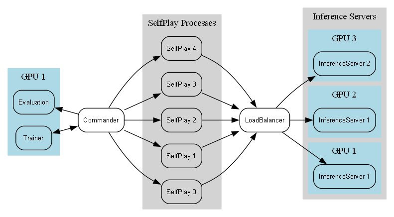
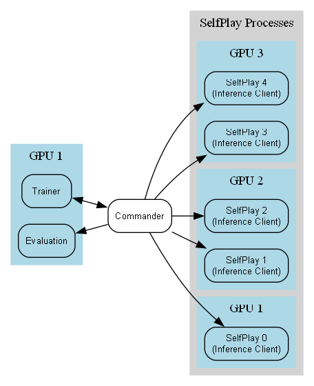

# Different Inference Server Architectures

In the **AlphaZero-Clone** project, three distinct inference server architectures have been explored to optimize performance, scalability, and resource utilization. Each architecture presents unique advantages and trade-offs, influencing factors such as caching efficiency, GPU utilization, and communication overhead. Below are detailed explanations of each architecture, accompanied by their respective diagrams.

## Table of Contents

- [Different Inference Server Architectures](#different-inference-server-architectures)
  - [Table of Contents](#table-of-contents)
  - [Core Components](#core-components)
    - [**Trainer**](#trainer)
    - [**Commander**](#commander)
    - [**Evaluation**](#evaluation)
    - [**SelfPlay Processes**](#selfplay-processes)
  - [1. Pipe Based Inference Server](#1-pipe-based-inference-server)
    - [Description](#description)
    - [Benefits](#benefits)
    - [Drawbacks](#drawbacks)
  - [2. Queue Based Inference Server](#2-queue-based-inference-server)
    - [Description](#description-1)
    - [Benefits](#benefits-1)
    - [Drawbacks](#drawbacks-1)
  - [3. Client Based Inference Server](#3-client-based-inference-server)
    - [Description](#description-2)
    - [Benefits](#benefits-2)
    - [Drawbacks](#drawbacks-2)
  - [Summary of Architectures](#summary-of-architectures)
  - [Conclusion](#conclusion)

---

## Core Components

The following components are integral to all inference server architectures. Their roles and interactions remain consistent across different setups.

### **Trainer**

- **Role:** Continuously updates the neural network model based on the latest self-play data.
- **Functionality:** Manages the training pipeline, ensuring that the model learns from recent games to improve its performance iteratively.

### **Commander**

- **Role:** Acts as the central orchestrator, managing communication between all other components.
- **Functionality:**
  - Facilitates the flow of information between the Trainer, SelfPlay processes, Inference Servers, and Evaluation.
  - Updates information about the current iteration being processed to ensure synchronization across the system.

### **Evaluation**

- **Role:** Assesses the performance of the current model against previous versions or predefined baselines.
- **Functionality:** Conducts evaluations to determine if the updated model demonstrates improvement, thereby deciding whether to promote it for further self-play and training.

### **SelfPlay Processes**

- **Role:** Generate self-play games using the current neural network model.
- **Functionality:** Simulate games by having the AI play against itself, producing game states, move probabilities, and outcomes that are used for training the model.

---

## 1. Pipe Based Inference Server

### Description

The **Pipe Based Inference Server** architecture leverages pipes for inter-process communication. This centralized approach directs all inference requests through dedicated inference servers, each mapped to a specific GPU. The **LoadBalancer** manages incoming inference requests from **SelfPlay** processes and distributes them to the appropriate **Inference Servers**. Additionally, all connections to the **Commander** are utilized to update information about the current iteration being processed.

- **Components:**
  - **LoadBalancer:** Manages and distributes inference requests to the Inference Servers.
  - **Inference Servers (InferenceServer 1 to InferenceServer 3):** Handle model inference tasks, each mapped to a specific GPU.
  - **SelfPlay Processes (SelfPlay 0 to SelfPlay 4):** Generate self-play games using the current model.

- **Connections:**
  - **Duplex Pipes:** Between **Trainer** and **Commander** for two-way communication.
  - **Unidirectional Pipes:** From **SelfPlay Processes** to **LoadBalancer**, and from **LoadBalancer** back to **SelfPlay Processes** for handling inference requests and responses.
  - **Commander to Inference Servers:** Direct connections to update information about the current iteration being processed.

### Benefits

- **Centralized Control:** Efficient batching and management of inference requests.
- **Organized Resource Allocation:** Clear mapping of processes to GPUs ensures dedicated resources for inference tasks.

### Drawbacks

- **Potential Bottleneck:** The **LoadBalancer** may become a choke point under high load.
- **Less Flexibility:** Centralized system might struggle with dynamic scaling and adaptability.

---

## 2. Queue Based Inference Server

### Description

The **Queue Based Inference Server** architecture utilizes queues for communication, allowing asynchronous handling of inference tasks. This design introduces greater flexibility and scalability compared to the pipe-based approach by managing tasks through dedicated queues. Importantly, in this system, the **Commander** maintains direct connections to the **Inference Servers** to update iteration information, ensuring synchronized processing across all components.

- **Components:**
  - **CacheManager:** Handles caching of inference results to optimize performance.
  - **Inference Servers (InferenceServer 1 to InferenceServer 3):** Handle model inference tasks, each mapped to a specific GPU.
  - **SelfPlay Processes (SelfPlay 0 to SelfPlay 4):** Generate self-play games using the current model.
  - **Queues (Inference Queue and Response Queue):** Facilitate asynchronous communication between components.

- **Connections:**
  - **Duplex Pipes:** Between **Trainer** and **Commander** for two-way communication.
  - **SelfPlay Processes to CacheManager:** All **SelfPlay** processes send inference requests to the **CacheManager**.
  - **CacheManager to Queues:** **CacheManager** enqueues tasks into the **Inference Queue**.
  - **Inference Queue to Inference Servers:** **Inference Servers** dequeue tasks from the **Inference Queue** for processing.
  - **Inference Servers to Response Queue:** Processed results are enqueued into the **Response Queue**.
  - **Response Queue to CacheManager:** **CacheManager** retrieves results and forwards them back to the respective **SelfPlay** processes.
  - **Commander to Inference Servers:** Direct connections to update information about the current iteration being processed.

### Benefits

- **Asynchronous Handling:** Improved scalability and flexibility in managing inference tasks.
- **Efficient Caching:** Centralized cache management reduces redundant computations.

### Drawbacks

- **Increased Complexity:** More components and communication channels can complicate the system.
- **Overhead from Queue Handling:** Managing multiple queues introduces additional processing overhead.
- **Potential Bottleneck:** **LoadBalancer** functionalities integrated within queues may still face bottlenecks under high load.

---

## 3. Client Based Inference Server

### Description

The **Client Based Inference Server** architecture decentralizes the inference workload by assigning individual inference clients to each **SelfPlay** process. Each client manages its own caching and communicates directly with the inference servers. This setup promotes simplicity but may lead to inefficiencies in caching and GPU utilization. Based on empirical results, this approach has proven to be the most effective, mitigating the communication overhead observed in the other architectures.

- **Components:**
  - **SelfPlay Processes with Inference Clients (SelfPlay 0 to SelfPlay 4):** Each **SelfPlay** process includes its own inference client, managing its own caching mechanisms.
  - **Inference Servers (InferenceServer 1 to InferenceServer 3):** Handle model inference tasks, each mapped to a specific GPU.

- **Connections:**
  - **Duplex Pipes:** Between **Trainer** and **Commander** for two-way communication.
  - **Direct Communication:** Each **SelfPlay Process** directly communicates with an **Inference Server** via inference requests and responses.
  - **Commander to Inference Servers:** Maintains connections to update information about the current iteration being processed.

### Benefits

- **Simpler Architecture:** More straightforward setup with direct client-server interactions.
- **Reduced Communication Overhead:** Fewer intermediaries can lead to faster communication between **SelfPlay** processes and **Inference Servers**.

### Drawbacks

- **Less Efficient Caching:** Decentralized caching can lead to less effective caching strategies, and potentially more redundant computations.
- **GPU Utilization:** Dependent on the OS's ability to schedule processes effectively.
- **Resource Allocation:** Multiple models per GPU can lead to reduced VRAM availability and smaller batch sizes.

---

## Summary of Architectures

| Architecture     | Communication Mechanism | Caching       | GPU Utilization                | Complexity | Pros                                          | Cons                                                                        | Time to Process 1000 Samples (seconds) |
| ---------------- | ----------------------- | ------------- | ------------------------------ | ---------- | --------------------------------------------- | --------------------------------------------------------------------------- | -------------------------------------- |
| **Pipe Based**   | Pipes                   | Centralized   | Dedicated per Inference Server | High       | Centralized control, efficient batching       | Potential bottleneck at LoadBalancer, less flexibility                      | 430.68                                 |
| **Queue Based**  | Queues                  | Centralized   | Dedicated per Inference Server | Moderate   | Asynchronous handling, scalable               | Overhead from queue handling, potential bottleneck at LoadBalancer          | 224.13                                 |
| **Client Based** | Direct Client-Server    | Decentralized | Dedicated per Inference Server | Low        | Simpler setup, reduced communication overhead | Less efficient caching, potential GPU underutilization, resource contention | 40                                     |

---

## Conclusion

Each inference server architecture presents unique advantages and trade-offs:

- **Pipe Based:** Offers centralized control and efficient batching but may encounter bottlenecks at the load balancer. Suitable for environments where centralized management is preferred.
  
- **Queue Based:** Enhances scalability and flexibility through asynchronous task handling but introduces increased complexity and potential overhead from queue management. Ideal for systems requiring robust and scalable inference management.
  
- **Client Based:** Simplifies the setup with direct client-server interactions and reduced communication overhead. Based on empirical results, this approach worked best by minimizing communication overhead inherent in Python multiprocessing, despite challenges with caching efficiency and GPU utilization. Best suited for simpler or smaller-scale deployments where ease of implementation and performance are prioritized.

Selecting the appropriate architecture depends on the specific requirements and constraints of the project, such as scalability needs, resource availability, and desired performance metrics. Given the observed performance benefits, the **Client Based** architecture is recommended for optimal results in the current setup.
