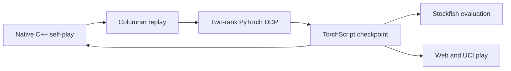

# AlphaZero chess on consumer GPUs

This project trains AlphaZero-style chess models from scratch through self-play, without human games or pretrained
chess data. Eight consumer GPUs are shared between self-play, learning, and evaluation, with every major design
decision judged by playing strength per wall-clock hour.

The final training run is in progress. Its recipe is written out in full in
[`chess-final-config.yaml`](py/configs/production/chess-final-config.yaml); terminal strength, training volume,
effective duration, and cost will be published after the run is preserved and the final evaluation protocol is
complete.

[Play against the model](https://chess.bertil-braun.de/) ·
[Download the weights](https://huggingface.co/BertilBraun/alphazero-chess) ·
[Follow the final result](documentation/results/final-chess-run.md)

| Final-run result | Status |
| --- | --- |
| Selected checkpoint and model size | **Pending** |
| Effective training time and cost | **Pending** |
| Optimizer steps, games, and fresh positions | **Pending** |
| Policy-only and 64-search strength | **Pending terminal evaluation** |
| 10,000-search strength | **Pending terminal evaluation** |
| High-search / approximately five-second strength | **Pending terminal evaluation** |
| Cross-lineage 64-search progress figure | **Pending final V89–V93 archive** |

## Previous verified result: v34

The previous completed public checkpoint trained for about three days at a rounded training-node cost of **$52**.
Its terminal benchmark remains the verified reference until the active final run is archived and evaluated.

| Search per move | Direct opponent | Score | Benchmark Elo (95% CI) |
| ---: | --- | ---: | ---: |
| 64 | Stockfish 13 at 5,000 nodes | 56.50% | 2,265 [2,236, 2,297] |
| 10,000 | Stockfish 13 at 100,000 nodes | 41.00% | 3,037 [3,012, 3,061] |
| 80,000 | Stockfish 13 at 100,000 nodes | 59.50% | 3,167 [3,143, 3,193] |

Each row is a 400-game match over 200 balanced opening pairs. The numbers use this project's historical
SSDF-derived Stockfish-node calibration; they are benchmark Elo rather than FIDE ratings. The complete benchmark
contains every game, artifact hash, confidence interval, and exact search configuration.

The v34 checkpoint is internally identified as generation 1465. It is a 14-block, 160-channel residual
network with 6,256,365 inference parameters.

The [rating-scale note](documentation/analysis/chess-elo-scale-and-reporting-20260911.md) explains the SSDF-derived
Stockfish-node anchors and recommends language for public reporting.

### Superhuman playing strength

At 80,000 MCTS searches per move, the saved generation-1465 model scored **59.50%** against Stockfish 13 limited
to 100,000 nodes per move: 143 wins, 190 draws, and 67 losses across 400 games. This gives **3,167 SSDF-calibrated
benchmark Elo [3,143, 3,193]**. The scale comes from
[Marco Meloni's Stockfish 13 node-strength curve](https://www.melonimarco.it/en/2021/03/08/stockfish-and-lc0-test-at-different-number-of-nodes/),
which anchors fixed-node Stockfish 13 through Fruit 2.2.1 to the historical SSDF scale. Under that calibration, the
result is clear evidence of superhuman playing strength; the number is a benchmark rating, not a FIDE rating.

An isolated benchmark of the same search configuration across 400 positions delivered an amortized mean of
**5.31 seconds per model move on one RTX 4070 SUPER** (5.19-second median), or about five seconds per move. This is
saturated batched throughput with 50 concurrent positions per GPU, rather than single-game response latency.

The project also compressed v34 into a 474,069-parameter network. The student is **13.20x smaller** and trails its
teacher by 166 Elo under the measured, saturated equal-time serving workload. Its model weights, manifests, raw
match evidence, and limitations are published in the
[replay-compression benchmark](documentation/benchmarks/chess-replay-distillation-v34-rtx4070s-20260911/README.md).

## Why the project matters

AlphaZero research normally assumes large fleets dedicated separately to self-play and training. This project used
8x RTX 4070 SUPER GPUs shared by both jobs. The central engineering question was how to reach useful strength when
fresh self-play data, evaluation resolution, and wall-clock throughput are all scarce.

The final recipe combines native batched tree search, progressive model sizing, a replay buffer growing to 20
million positions, policy-surprise sampling, value-disagreement-guided restart positions, richer chess history
features, SGD with Nesterov momentum, and QAT-backed TensorRT INT8 self-play. The negative results are retained too:
adaptive search budgeting and learned early stopping were implemented, measured, and removed when they failed to
earn their compute cost.

The final publication will lead with one matched 64-search ladder-Elo plot spanning the major training lineages from
v9 through v29, v34, the v46/v48-era successor, and the final V89–V93 continuation. That figure is intentionally
deferred until the active run is complete: its curves will be regenerated from archived scalar data, the V89–V93
segments will be joined on effective elapsed time, and every protocol transition will be marked rather than hidden.


By the retained checkpoint, the run had completed **732,500 optimizer steps** and **2.93 million self-play games**,
materialising **187.5 million fresh positions** and consuming **1.50 billion training presentations**. The
[training-dynamics report](documentation/benchmarks/chess-v34-training-dynamics-rtx4070s-20260912/README.md)
contains the hourly strength curve, compute-doubling returns, model and visit throughput changes, raw tables, and a
playbook for scaling beyond one eight-GPU node.

For the evidence trail, start with:

- [Final chess run](documentation/results/final-chess-run.md) for the active result contract and pending fields;
- [Technical report](documentation/report/README.md) for the detailed methods, experiments, systems work, and
  limitations;
- [Experiment ledger](documentation/experiments/README.md) for every retained, rejected, inconclusive, superseded,
  or proposed technique and its primary evidence;
- [Current state](documentation/CURRENT-STATE.md) for the precise status of the run and publication work;
- [v34 terminal strength](documentation/benchmarks/chess-terminal-v34-generation1465-rtx4070s-20260911/README.md)
  for final-match evidence at policy-only, 64, 10,000, and 80,000 searches;
- [v34 training dynamics](documentation/benchmarks/chess-v34-training-dynamics-rtx4070s-20260912/README.md) for
  optimizer steps, self-play volume, strength by hour, compute-doubling returns, and the scaling playbook;
- [v34 final evaluation plan](documentation/plan/v34-final-evaluation-and-distillation.md) for the terminal protocol;
- [v34 replay compression](documentation/benchmarks/chess-replay-distillation-v34-rtx4070s-20260911/README.md) for
  the completed small-model experiment and downloadable weights;
- [v29 strength versus wall-clock](documentation/benchmarks/ladder-elo-vs-generation-rtx4070s-20260906/README.md)
  and [its deep match](documentation/benchmarks/deep-match-generation936-50k-nodes-rtx4070s-20260906/README.md) for
  the last fully documented absolute-strength baseline;
- [compute-poor recipe analysis](documentation/analysis/reference-recipes-for-a-compute-poor-run.md) for the
  literature and design rationale.

## How the system works


```mermaid
flowchart LR
    A[Native C++ self-play] --> B[Columnar replay]
    B --> C[Two-rank PyTorch DDP]
    C --> D[TorchScript checkpoint]
    D --> A
    D --> E[Stockfish evaluation]
    D --> F[Web and UCI play]
```

The runtime has one implementation of game rules and search:

- [`cpp/`](cpp/README.md) owns chess and Go state, action mapping, packed input encoding, batched TorchScript
  inference, MCTS, self-play, and interactive analysis.
- [`py/`](py/README.md) owns validated experiment configuration, replay ingestion, distributed training,
  checkpoint publication, evaluation, telemetry, and orchestration.
- [`deployment/`](documentation/operations/README.md) contains fresh-node setup, run control, web play, and Lichess
  deployment.
- [`documentation/`](documentation/README.md) separates current guidance, accepted architecture, reproducible
  operations, benchmark evidence, plans, and history.

The [current-system guide](documentation/system/README.md) follows the implemented training path from native search
through replay, distributed training, TensorRT publication, and evaluation without requiring readers to reconstruct
it from historical rework plans.

Chess is the active research result. The same runtime also supports Go on 7x7 and 9x9 boards, but the Go work has
not received an equivalent final training campaign.

## Build and validate

Python 3.12 and `uv` are required. A CUDA-capable Linux environment is needed for production training; a local
build can use the available LibTorch target.

```powershell
uv sync --locked
cmake -S .\cpp -B .\cpp\build -DCMAKE_BUILD_TYPE=Release -DBUILD_TESTING=ON
cmake --build .\cpp\build --parallel
ctest --test-dir .\cpp\build --output-on-failure
Set-Location .\py
python -m pytest --import-mode=importlib .\test -q
```

On rented compute, use [`deployment/setup_remote.sh`](deployment/setup_remote.sh) to provision and
[`deployment/run_control.sh`](deployment/run_control.sh) to start, stop, preserve, and fetch a run. Production runs
require an exact source revision, resolved configuration hash, and explicit approval record. A run without a fetched
archive is not accepted as evidence.

## Play and deploy

The same native interactive engine backs both interfaces:

- [browser play](documentation/operations/web-play.md) through FastAPI and the web client;
- [UCI and Lichess](deployment/lichess/README.md) through `python -m src.games.chess.uci`.

The public model repository is [BertilBraun/alphazero-chess](https://huggingface.co/BertilBraun/alphazero-chess).
Deployment status and exact model provenance are documented separately from research checkpoints so a measured
model is not mistaken for the currently served model.

## Reproducibility and scope

Every accepted benchmark records its source revision, hardware, resolved configuration SHA-256, and raw results.
The [documentation index](documentation/README.md) explains which documents are current authority and which are
historical evidence. The [historical research backlog](documentation/history/historical-research-backlog-20260822.md)
is an idea ledger and does not authorize experiments.

This repository currently has no top-level software or model license. Inspect that status before redistributing or
building on the code or weights.
