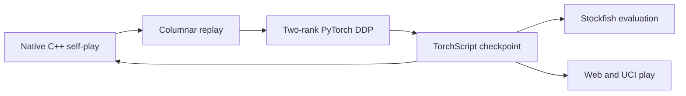

# AlphaZero chess on a compute budget

This repository trains and serves AlphaZero-style chess and Go agents with a C++20 search engine and a typed Python
training runtime. Its main result is a strong chess model trained from self-play on eight consumer GPUs for about
three days, at a nominal training-node cost of **$51.84** (about $52).

The retained v34 checkpoint is generation 1465, a 14-block, 160-channel residual network with 6,256,365 inference
parameters. Terminal Stockfish calibration places it at **3,037 benchmark Elo [3,012, 3,061] at 10,000 searches per
move** and **3,174 [3,144, 3,206] at 80,000 searches per move**. These are conditional ratings on an SSDF-derived
Stockfish 13 fixed-node ladder. They are not FIDE ratings and should not be compared directly with human ratings.
The [complete terminal benchmark](documentation/benchmarks/chess-terminal-v34-generation1465-rtx4070s-20260911/README.md)
contains all 800 headline-match games and the exact search configurations.

The [rating-scale note](documentation/analysis/chess-elo-scale-and-reporting-20260911.md) explains the SSDF-derived
Stockfish-node anchors and recommends language for public reporting.

The project also compressed v34 into a 474,069-parameter network. The student is **13.20x smaller** and trails its
teacher by 166 Elo under the measured, saturated equal-time serving workload. Its model weights, manifests, raw
match evidence, and limitations are published in the
[replay-compression benchmark](documentation/benchmarks/chess-replay-distillation-v34-rtx4070s-20260911/README.md).

## Why this result matters

AlphaZero research normally assumes large fleets dedicated separately to self-play and training. This project used
8x RTX 4070 SUPER GPUs shared by both jobs. The central engineering question was how to reach useful strength when
fresh self-play data, evaluation resolution, and wall-clock throughput are all scarce.

The final recipe combines a native batched tree search, progressive model sizing, a bounded 10-million-position
replay, policy-surprise replay sampling, regret-guided restart positions, richer chess history features, and a
staged AdamW schedule. The negative results are retained too: adaptive search budgeting and learned early stopping
were implemented, measured, and removed when they failed to earn their compute cost.

For the evidence trail, start with:

- [Current state](documentation/CURRENT-STATE.md) for the precise status of the run and publication work;
- [v34 terminal strength](documentation/benchmarks/chess-terminal-v34-generation1465-rtx4070s-20260911/README.md)
  for final-match evidence at policy-only, 64, 10,000, and 80,000 searches;
- [v34 final evaluation plan](documentation/plan/v34-final-evaluation-and-distillation.md) for the terminal protocol;
- [v34 replay compression](documentation/benchmarks/chess-replay-distillation-v34-rtx4070s-20260911/README.md) for
  the completed small-model experiment and downloadable weights;
- [v29 strength versus wall-clock](documentation/benchmarks/ladder-elo-vs-generation-rtx4070s-20260906/README.md)
  and [its deep match](documentation/benchmarks/deep-match-generation936-50k-nodes-rtx4070s-20260906/README.md) for
  the last fully documented absolute-strength baseline;
- [compute-poor recipe analysis](documentation/analysis/reference-recipes-for-a-compute-poor-run.md) for the
  literature and design rationale.

## How the system works


```mermaid
flowchart LR
    A[Native C++ self-play] --> B[Columnar replay]
    B --> C[Two-rank PyTorch DDP]
    C --> D[TorchScript checkpoint]
    D --> A
    D --> E[Stockfish evaluation]
    D --> F[Web and UCI play]
```

The runtime has one implementation of game rules and search:

- [`cpp/`](cpp/README.md) owns chess and Go state, action mapping, packed input encoding, batched TorchScript
  inference, MCTS, self-play, and interactive analysis.
- [`py/`](py/README.md) owns validated experiment configuration, replay ingestion, distributed training,
  checkpoint publication, evaluation, telemetry, and orchestration.
- [`deployment/`](documentation/operations/README.md) contains fresh-node setup, run control, web play, and Lichess
  deployment.
- [`documentation/`](documentation/README.md) separates current guidance, accepted architecture, reproducible
  operations, benchmark evidence, plans, and history.

Chess is the active research result. The same runtime also supports Go on 7x7 and 9x9 boards, but the Go work has
not received an equivalent final training campaign.

## Build and validate

Python 3.12 and `uv` are required. A CUDA-capable Linux environment is needed for production training; a local
build can use the available LibTorch target.

```powershell
uv sync --locked
cmake -S .\cpp -B .\cpp\build -DCMAKE_BUILD_TYPE=Release -DBUILD_TESTING=ON
cmake --build .\cpp\build --parallel
ctest --test-dir .\cpp\build --output-on-failure
Set-Location .\py
python -m pytest --import-mode=importlib .\test -q
```

On rented compute, use [`deployment/setup_remote.sh`](deployment/setup_remote.sh) to provision and
[`deployment/run_control.sh`](deployment/run_control.sh) to start, stop, preserve, and fetch a run. Production runs
require an exact source revision, resolved configuration hash, and explicit approval record. A run without a fetched
archive is not accepted as evidence.

## Play and deploy

The same native interactive engine backs both interfaces:

- [browser play](documentation/operations/web-play.md) through FastAPI and the web client;
- [UCI and Lichess](deployment/lichess/README.md) through `python -m src.games.chess.uci`.

The public model repository is [BertilBraun/alphazero-chess](https://huggingface.co/BertilBraun/alphazero-chess).
Deployment status and exact model provenance are documented separately from research checkpoints so a measured
model is not mistaken for the currently served model.

## Reproducibility and scope

Every accepted benchmark records its source revision, hardware, resolved configuration SHA-256, and raw results.
The [documentation index](documentation/README.md) explains which documents are current authority and which are
historical evidence. `THINGS_TO_TRY.md` is an idea backlog and does not authorize experiments.

This repository currently has no top-level software or model license. Inspect that status before redistributing or
building on the code or weights.
