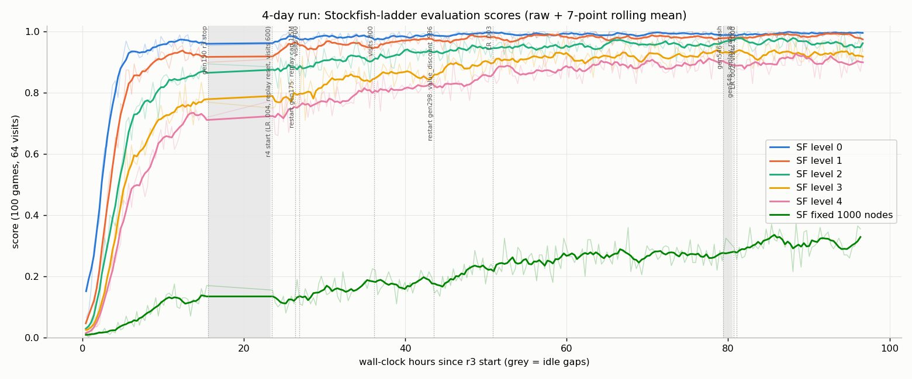
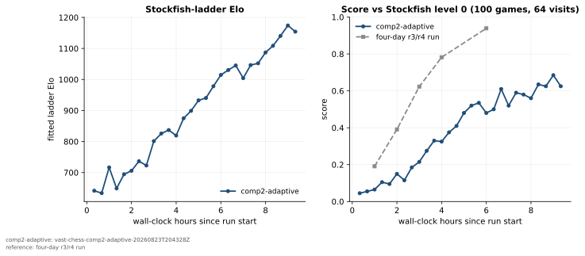

# AlphaZero, from scratch, on a rented GPU budget

A complete AlphaZero-style engine for **chess** and **Go** (7×7 and 9×9): self-play, tree search, network
training, and strength evaluation, written from the ground up. A C++20 runtime owns the parts that have to be
fast — rules, board encoding, batched TorchScript inference and the search tree — while Python owns experiment
configuration, self-play supervision, memory-mapped replay, DDP training and evaluation. Runs are rented by the
hour on Vast.ai, so every design decision is judged in Elo per wall-clock hour rather than in the abstract.

### ▶ [Play or analyse against the model — chess.bertil-braun.de](https://chess.bertil-braun.de)

Browser board, native search behind a FastAPI service, with policy priors, value and visit counts exposed per
candidate move. The [same engine](documentation/operations/lichess-vast-evaluation.md) also speaks UCI.

*The strongest run to date: four days on 8× RTX 3060, scores against six Stockfish rungs over wall-clock hours.
Level 0 is saturated within ~6 h; the bottom curve is Stockfish at a fixed 1,000 nodes.*

## Results

| Run | Compute | Strength | Evidence |
| --- | --- | --- | --- |
| 2024 legacy chess model | ~12 h on 4× A10 (≈$13) | ≈2,000–2,100 Elo against Stockfish | [record + games](documentation/evidence/chess-legacy-a10-2024/README.md) |
| Four-day run (r3/r4), 2026-08 | 96 h on 8× RTX 3060 (≈$44) | ≈2,800 fitted ladder Elo at 10k visits; generation 445 scored 66.0 % vs Stockfish 13 at 6,500 nodes (CI 58.5–73.5 %) | [freeze evidence](documentation/evidence/chess-four-day-freeze-20260817/), [ladder report](documentation/benchmarks/chess-stockfish-ladder-8xrtx3060-20260816/README.md) |
| Recovery run `production-v2` | 8× RTX 4070 SUPER, live until ~2026-08-28 | **in progress** — targeting the four-day run's wall-clock curve | plots land here when its archive is fetched |

The four-day result is the reference every current run is measured against; the
[recovery plan](documentation/plan/chess-recovery-plan-20260820.md) exists because a platform rework regressed
it, and the [regression analysis](documentation/plan/chess-post-four-day-regression-analysis-20260820.md) says
why. Nothing is claimed here that does not have a fetched archive behind it.

*Interim figure — a 9 h screening run against the four-day reference (dashed). Ladder Elo climbs monotonically;
against the reference the same level-0 score arrives hours later, which is the gap the current run is closing.
Regenerated from the production archive after 2026-08-28: see
[documentation/showcase/](documentation/showcase/README.md).*

## What is interesting here

- **[The experiment ledger](documentation/experiments/README.md)** — what was tried and what survived: why an
  attention trunk plateaued for seven hours (a BatchNorm eval-mode artifact in the generation-0 export flattened
  the policy prior, not the architecture), why replay ratio turned out to be a scheduling knob rather than a
  data-efficiency one, how a 208k-parameter policy head tied a 484k one, and why self-play throughput is bound
  by host CPU and batching rather than by GPU FLOPs.
- **Everything is measured.** Configurations are resolved and hashed; a run that has no fetched archive did not
  happen; benchmarks record hardware, source revision and config SHA, and are not compared across hardware.
- **One search, in C++.** There is no second, Python implementation of rules, encoding or MCTS to drift out of
  sync — a deliberately unoptimised Python PUCT reference exists only as an order-of-magnitude
  [baseline](documentation/benchmarks/naive-python-mcts-rtx3060-20260816/README.md) (~81 sims/s).

The production lifecycle in five steps: persistent workers run the native self-play search and publish atomic
trajectories → the coordinator drains them into one fixed-slot circular memory-mapped replay → persistent
symmetric DDP ranks train a blocking optimizer quantum from read-only mapped replay → rank zero publishes the
checkpoint and a trimmed policy/WDL inference artifact → workers switch generation while short-lived evaluation
jobs run on fixed elapsed boundaries. Diagrams: [C++ overview](documentation/architecture/diagrams/cpp-overview.png) ·
[inference pipeline](documentation/architecture/diagrams/cpp-inference-pipeline.png) ·
[chess input representation](documentation/architecture/diagrams/chess-input-representation.png) ·
[network architecture](documentation/architecture/diagrams/neural-network-architecture.png).

## Repository layout

| Path | Contents |
| --- | --- |
| `cpp/` | native chess/Go state, encoding, inference, search, bindings, benchmarks, tests |
| `py/` | experiment configuration, coordinator, replay, training, evaluation, UCI, tools |
| `deployment/` | fresh-node bootstrap, run control, web and Lichess deployment |
| `documentation/` | plan, architecture, operations, experiments, benchmarks, evidence |

## Go deeper

| Topic | Start here |
| --- | --- |
| Setup, running a training run, validation | [documentation/ONBOARDING.md](documentation/ONBOARDING.md) |
| What the system is *today* | [documentation/CURRENT-STATE.md](documentation/CURRENT-STATE.md) |
| Accepted designs | [documentation/architecture/](documentation/architecture/README.md) |
| Measurements, with hardware and config SHAs | [documentation/benchmarks/](documentation/benchmarks/README.md) |
| Experiment ledger — what worked and what did not | [documentation/experiments/](documentation/experiments/README.md) |
| Operating a run: control, evaluation engines, deployment | [documentation/operations/](documentation/operations/README.md) |
| Generated showcase figures and how to regenerate them | [documentation/showcase/](documentation/showcase/README.md) |
| Full documentation index | [documentation/README.md](documentation/README.md) |

## Running it yourself

Realistically nobody will reproduce a four-day 8-GPU run, but everything needed to do so is checked in:
[`deployment/setup_remote.sh`](deployment/setup_remote.sh) bootstraps a fresh node (clone, locked environment,
Release extension, engine smoke test) and [`deployment/run_control.sh`](deployment/run_control.sh) is the only
supported way to start, stop, inspect and archive a run. Local build, test and lint commands, the config-template
rules and the read-in-this-order path are in [documentation/ONBOARDING.md](documentation/ONBOARDING.md);
entry points are in [`py/README.md`](py/README.md) and [`cpp/README.md`](cpp/README.md).

## Research and references

[Experiment backlog](THINGS_TO_TRY.md) (ideas, not authorised runs) ·
[research references](documentation/references.md) ·
[historical insights](documentation/history/insights-and-recommendations.md) ·
[`pre-rework`](https://github.com/BertilBraun/Advanced-Techniques-in-Chess-Engines/releases/tag/pre-rework) and
[`four-day-baseline`](https://github.com/BertilBraun/Advanced-Techniques-in-Chess-Engines/releases/tag/four-day-baseline)
releases.
