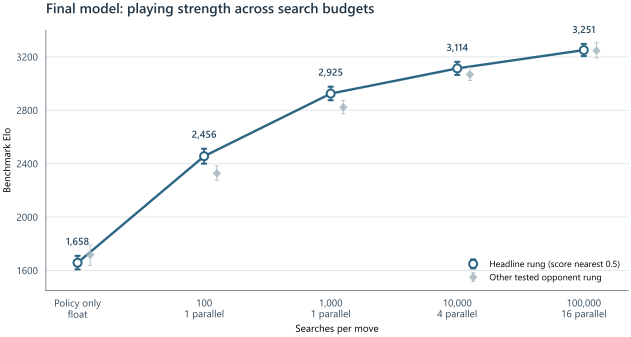

# AlphaZero chess on consumer GPUs

How strong can an AlphaZero-style chess system become under a very limited compute budget when the entire learning
loop is engineered for efficiency? This project trained chess models from random initialization through self-play,
without human games or pretrained chess weights, while sharing eight RTX 4070 SUPER GPUs among self-play, learning,
and evaluation.

The selected 6.32-million-parameter convolutional model reached **3,251 benchmark Elo at 100,000 searches per
move** and **1,658 without search** in paired games against fixed-node Stockfish 13. A matched-estimator comparison
places its 64-search training plateau about **74 Elo** above the previous completed baseline. These numbers use a
historical Stockfish-node calibration; they are not FIDE ratings or claims against unrestricted current engines.
The full match protocol, intervals, artifacts, and limitations are in the
[final result record](documentation/results/final-chess-run.md) and [technical report](documentation/report/README.md).

[Play against the model](https://chess.bertil-braun.de/) ·
[Model repository](https://huggingface.co/BertilBraun/alphazero-chess) ·
[Read the technical report](documentation/report/README.md)

## Measured strength

Each terminal row used 100 games over 50 colour-swapped opening pairs. The reported rating uses the opponent node
limit whose match score was closest to 50%; the other measured rung is shown in the report. Search counts are per
move. Searched play used the selected INT8 TensorRT artifact; policy-only play used its float TorchScript export.

| Model searches | Benchmark Elo (95% CI) | Opponent and score |
| ---: | ---: | --- |
| Policy only | **1,658 [1,608, 1,710]** | Stockfish 13, 1,000 nodes; 44.0% |
| 100 | **2,456 [2,400, 2,512]** | 10,000 nodes; 48.0% |
| 1,000 | **2,925 [2,875, 2,977]** | 50,000 nodes; 45.0% |
| 10,000 | **3,114 [3,065, 3,163]** | 100,000 nodes; 52.0% |
| 100,000 | **3,251 [3,206, 3,297]** | 200,000 nodes; 53.0% |



The connected points use the closest-to-50% opponent rung; pale diamonds show the second measured rung. The
horizontal categories do not represent equal compute increments. Search parallelism rises from one at 100 and
1,000 searches to four at 10,000 and sixteen at 100,000, so this is a measured operating curve rather than an
isolated search-budget ablation. The [results chapter](documentation/report/07-final-run-results.md) gives the
protocol and uncertainty in detail, including the independent parallel-search sweep.

## Progress under a limited budget

The accepted final training lineage spans **2.5 effective days** and its selected checkpoint records **408,500
optimizer steps** at a global batch of 2,048: **836.6 million training presentations**. Its narrow effective
training cost is **$43.20** at the recorded **$0.72/hour**. That is not total project spending: it excludes reverted
work, later capacity experiments, distillation, evaluation, and idle rental time. The selected-checkpoint coordinator
record covers **3.25 million ingested completed games**, about **209.15 million net materialized positions**, and a
**16-million-row live replay**. These are not totals for all project experiments; total expenditure remains
unreconciled. The [evidence index](documentation/evidence/final-chess-20260923/README.md#training-volume-extraction)
defines each counter.


The curves show consistent progress across major training campaigns, with the final lineage trimmed at 2.5 days
and the preceding baseline at its clean three-day endpoint. The displayed endpoints should not be subtracted as a
cross-campaign Elo claim because the ladder estimator changed. The approximately 74-Elo plateau comparison uses a
matched estimator; [Chapter 7](documentation/report/07-final-run-results.md) explains that calculation and the
excluded intervals.

## How it works


The native [C++ engine](cpp/README.md) owns chess rules, search trees, game state, and batched neural inference.
The [Python runtime](py/README.md) owns typed configuration, replay ingestion, distributed training, publication,
and evaluation. Self-play and training overlap on the same GPUs. The final recipe uses progressive small-to-medium
model sizing, fixed staged search budgets, restart positions, a growing replay window, policy-surprise sampling,
calibrated resignation, and quantization-aware TensorRT serving. Search, replay, and network decisions are treated
as one coupled learning system rather than independent speed tricks.

The report documents what was retained and what was rejected: KataGo-inspired fast/full searches, adaptive search
allocation and stopping, Monte Carlo graph search, inference caching, attention trunks, several policy-head
representations, quantization strategies, auxiliary targets, and compression. It distinguishes playing-strength
evidence from throughput, fidelity, and short frozen-replay probes. Start with the
[report reader path](documentation/report/README.md) or browse the [experiment ledger](documentation/experiments/README.md).

The fully expanded [final chess configuration](py/configs/production/chess-final-config.yaml) is the living entry
point for reproducing or extending the recipe. The selected run's exact revision, hashes, and evaluation evidence
are frozen separately in the [final result record](documentation/results/final-chess-run.md). Go on 7×7 and 9×9
boards is supported by the same runtime, but chess is the research result presented here.

## Build and validate

Python 3.12 and `uv` are required. Production training needs CUDA-capable Linux; a local native build can use the
available LibTorch target.

```powershell
uv sync --locked
cmake -S .\cpp -B .\cpp\build -DCMAKE_BUILD_TYPE=Release -DBUILD_TESTING=ON
cmake --build .\cpp\build --parallel
ctest --test-dir .\cpp\build --output-on-failure
Set-Location .\py
python -m pytest --import-mode=importlib .\test -q
```

On rented compute, [`deployment/setup_remote.sh`](deployment/setup_remote.sh) provisions a node and
[`deployment/run_control.sh`](deployment/run_control.sh) controls and preserves a run. The
[experiment platform guide](documentation/operations/experiment-platform.md) is the operational authority; the
technical report is not a runbook.

## Play, evidence, and reuse

The same native engine powers [browser play](documentation/operations/web-play.md) and
[UCI/Lichess](deployment/lichess/README.md). The live site and model card may be updated independently of this
measured checkpoint; check their artifact identities before equating a live game with the reported result.

The [documentation index](documentation/README.md) separates current guidance, benchmark evidence, plans, and
history. This repository currently has no top-level software or model license; inspect that status before
redistributing code or weights.
