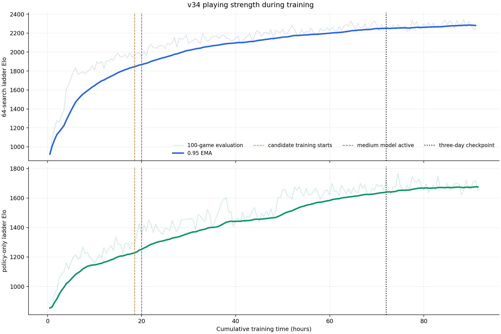
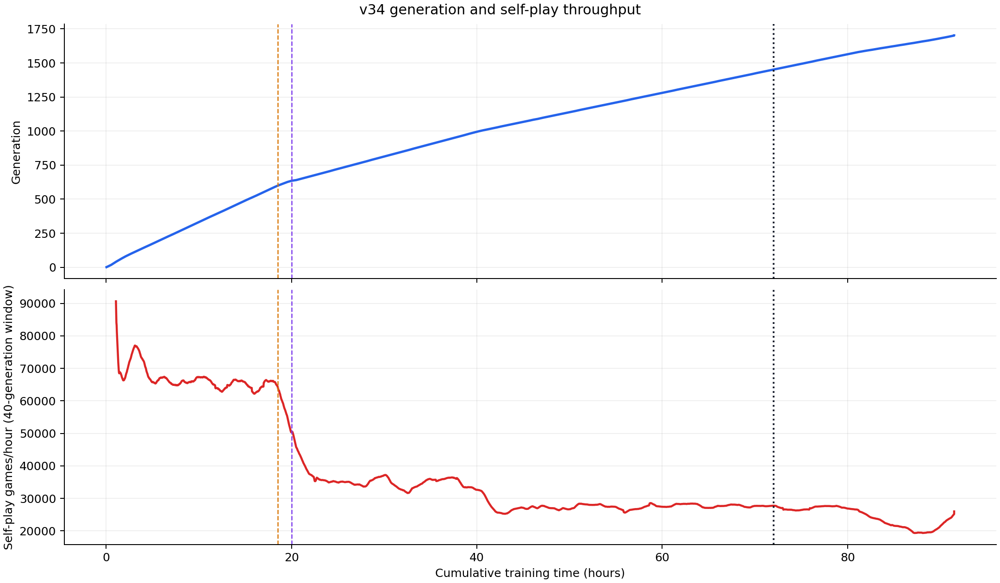
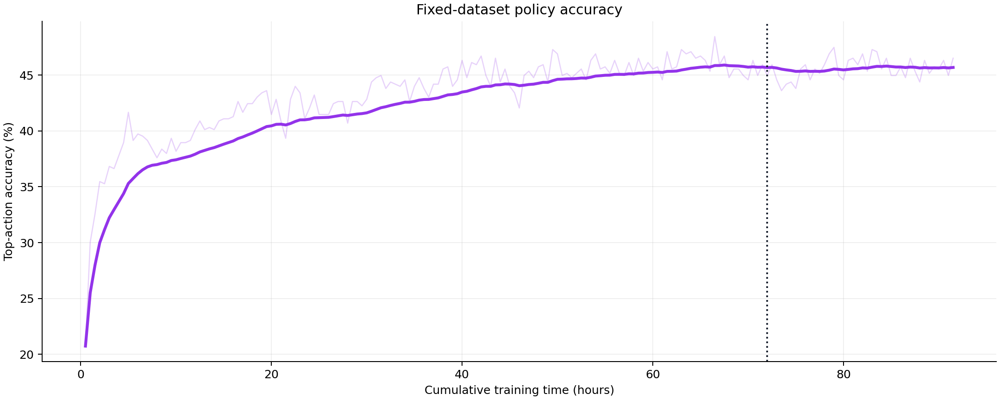

# v34 training dynamics and scaling playbook

This report describes how the retained v34 chess lineage used compute and gained strength. The publication
checkpoint is generation 1465, conventionally called the three-day checkpoint. The figures include the exploratory
tail through generation 1702 so that the late plateau remains visible. Every plotted evaluation point contains 100
games; the heavy line is TensorBoard's debiased 0.95 exponential moving average (EMA).



## Three-day checkpoint

| Quantity | Recorded value |
| --- | ---: |
| Generation | 1465 |
| Optimizer steps | 732,500 |
| Self-play games | 2,925,085 |
| Fresh replay positions | 187,524,912 |
| Training presentations | 1,500,160,000 |
| Empirical replay ratio | 8.000 |
| Estimated MCTS searches | 122.6 billion |
| Mean self-play rate | about 40,100 games/hour, or 11.1 games/second |
| Mean fresh-data rate | about 2.57 million positions/hour, or 714 positions/second |
| Mean accepted positions/game | 64.1 |
| Headline compute and rental | 576 GPU-hours; $52 rounded at $17.36/day |

The TensorBoard time coordinate places generation 1465 at approximately 73 hours, while the retained checkpoint's
public cost accounting uses the authorised three-day rental interval. Rates in the generated artifacts use the
recorded TensorBoard time; the headline cost remains the verified three-day figure. Estimated searches multiply
newly materialized replay positions by the configured visit budget at that generation. It is consequently an
estimate of useful recorded search work, not a hardware-counter measurement.

## Strength by elapsed hour

| Hour | Generation | Policy-only Elo, 0.95 EMA | 64-search Elo, 0.95 EMA | Top-action accuracy, 0.95 EMA |
| ---: | ---: | ---: | ---: | ---: |
| 1 | 38 | 862 | 1,010 | 25.5% |
| 2 | 77 | 916 | 1,130 | 30.0% |
| 4 | 142 | 1,019 | 1,282 | 33.7% |
| 8 | 268 | 1,128 | 1,574 | 37.0% |
| 16 | 520 | 1,207 | 1,803 | 39.1% |
| 32 | 849 | 1,377 | 2,038 | 42.2% |
| 64 | 1337 | 1,607 | 2,219 | 45.6% |
| 72 | 1451 | 1,641 | 2,250 | 45.7% |

These are low-budget in-run indicators. They are appropriate for trends within this run, but they are not the
reported strength level. The retained generation-1465 checkpoint subsequently measured 3,037 benchmark Elo at
10,000 searches and 3,167 at 80,000 searches in the [terminal benchmark](../chess-terminal-v34-generation1465-rtx4070s-20260911/README.md).

## What doubling compute bought

Because the same eight GPUs ran throughout, doubling elapsed training time also doubled cumulative GPU-hours. The
table reports the change in the 0.95-smoothed indicators during each doubling interval.

| Interval | Additional GPU-hours | Policy-only Elo gain | 64-search Elo gain | 64-search Elo/hour |
| ---: | ---: | ---: | ---: | ---: |
| 1 -> 2 h | 8 | +54 | +120 | 119.7 |
| 2 -> 4 h | 16 | +103 | +152 | 76.1 |
| 4 -> 8 h | 32 | +109 | +292 | 73.0 |
| 8 -> 16 h | 64 | +79 | +229 | 28.7 |
| 16 -> 32 h | 128 | +170 | +235 | 14.7 |
| 32 -> 64 h | 256 | +230 | +180 | 5.6 |

This is a time-scaling curve for one online run, not a hardware scaling law. Twice as many GPUs for half as long
changes the rate at which data enters replay, the age distribution, and the number of policy iterations that
generated that data. It will reproduce the table only if self-play, training, replay ingestion, and checkpoint
distribution all scale together.

## Throughput changes

Candidate training began at hour 18.5, around generation 599. The 14x160 model became active at generation 634,
around hour 20. The clearest like-for-like comparison holds self-play at 600 visits:

| Phase | Generations/hour | Games/hour | Fresh positions/second |
| --- | ---: | ---: | ---: |
| 12x128, 600 visits, before candidate | 31.6 | 65,947 | 1,122 |
| Candidate catch-up | 24.4 | 49,579 | 868 |
| 14x160, 600 visits | 18.0 | 34,829 | 639 |
| 14x160, 800 visits | 14.2 | 27,257 | 506 |

The medium model therefore reduced generation throughput by about 43% and fresh-position throughput by about 43%
at the same 600-visit budget. Raising visits from 600 to 800 on the medium model cost a further 21% in both rates.
Candidate catch-up temporarily cost about 23% relative to the steady small-model phase.



The fixed-position policy metric largely saturated by the three-day point even while playing strength continued to
move slowly. It is useful diagnostic context, but individual cross-entropy and accuracy values cannot identify
whether a different self-play policy is stronger.



## How to outscale this run

A credible 24-GPU successor would use three eight-GPU nodes and preserve the relationships that made v34 work:

1. **Scale fresh self-play first.** At the terminal 14x160/800-visit phase, eight GPUs produced about 506 accepted
   positions/second. Measure the new network's positions/second before launching. More parameters are beneficial
   only if additional actor GPUs compensate for their inference cost.
2. **Provision training for the generated data.** With replay ratio 8, every additional fresh position requires
   eight training presentations. A threefold actor-rate increase requires roughly threefold sustained trainer and
   replay-loader throughput, or an intentional change to the reuse ratio.
3. **Separate actor and trainer capacity.** A practical multi-node layout dedicates actor GPUs to self-play and a
   tightly connected node to distributed training. It needs measured checkpoint-broadcast latency, replay-shard
   ingress, storage bandwidth, and backpressure. The current single-node process topology should not be assumed to
   scale across hosts without this work.
4. **Keep visit depth tied to the data budget.** More visits improve each target but reduce the number of distinct
   targets. V34's 600-to-800 change cost 21% of fresh-position throughput. Select visits by Elo gained per total
   search, then spend additional hardware on both breadth and depth.
5. **Increase replay capacity only with data production.** A larger window does not create information. Size it in
   hours and generations of fresh data, track mean and percentile age, and prevent a larger store from becoming a
   stale-data subsidy.
6. **Retune the optimizer as a matched experiment.** SGD with momentum is plausible, but its learning rate, warm-up,
   weight decay, and terminal schedule require independent tuning. Compare AdamW and SGD across matched seeds and
   fresh-data streams; a frozen-replay test can reject bad settings but cannot establish online generalisation.
7. **Benchmark architecture by strength per second.** Preserve GPU-efficient channel multiples. Compare candidate
   networks on training samples/second, self-play positions/second, policy-only strength, and searched strength.
   Parameter count alone is not an efficiency metric.
8. **Predeclare measurements that can resolve the expected gain.** The 100-game in-run points establish trends,
   while effects of tens of Elo need thousands of paired games for a narrow estimate. Reuse fixed opening pairs,
   retain configuration and model hashes, and reserve deep matches for milestone checkpoints.

The most useful additional run statistics are replay-position age percentiles, outcome and termination mix, game
length distribution, trainer duty cycle, credit starvation, GPU utilisation and power, inference batch fill,
checkpoint distribution latency, and strength gained per dollar and GPU-hour. Together they reveal whether the
next dollar should buy more actors, more trainer capacity, deeper targets, or a larger network.

## Reproduction and evidence

[`analyze_training.py`](analyze_training.py) reads the complete scalar history rather than TensorBoard's sampled
reservoir. It writes the figures and the following machine-readable tables:

- [`milestones.csv`](artifacts/milestones.csv) contains raw and smoothed measurements at every requested hour;
- [`compute-doubling.csv`](artifacts/compute-doubling.csv) contains marginal returns for each doubling interval;
- [`phase-throughput.csv`](artifacts/phase-throughput.csv) contains model-, visit-, and learning-rate phase rates;
- [`summary.json`](artifacts/summary.json) contains the aggregate checkpoint statistics.
- [`SHA256SUMS`](SHA256SUMS) covers the generated tables and figures.

The source is the SHA-256-verified local archive
`.codex-diagnostics/v34-g1702-preserved-20260912T032010Z`. Its TensorBoard history is canonical through generation
1702. The generation-1220 to generation-1465 terminal segment used configuration SHA-256
`5a1194975e225d4c5ebc329ca7641b205e7cd17b88d5b4aa24679d9e6a939c9a` and source revision
`a05ff45be568fb6ad51730c4e8d2f482b05327bc`. Earlier stops and configuration changes are retained in the run's
archive history; conclusions that compare phases explicitly carry the model, visit budget, and learning rate.

Run from the repository root:

```powershell
python .\documentation\benchmarks\chess-v34-training-dynamics-rtx4070s-20260912\analyze_training.py `
  --archive .\.codex-diagnostics\v34-g1702-preserved-20260912T032010Z `
  --output .\documentation\benchmarks\chess-v34-training-dynamics-rtx4070s-20260912\artifacts
```
