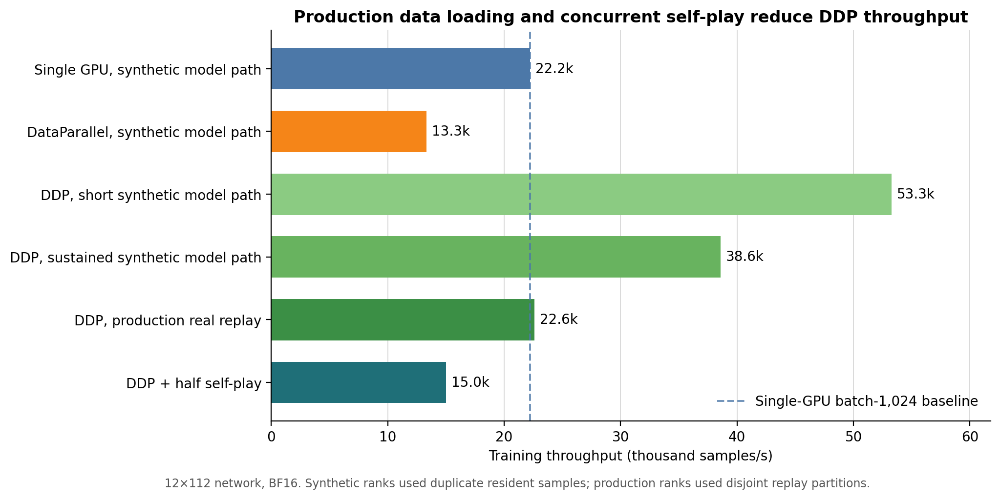
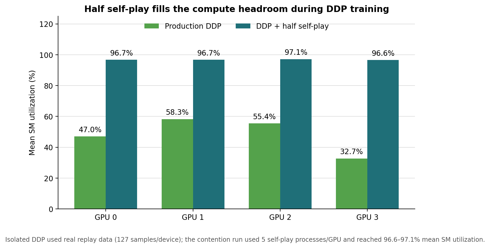

# Neural-network training parallelism benchmark

This report compares single-GPU training, single-process PyTorch
`DataParallel`, and multi-process `DistributedDataParallel` (DDP) for the
3.24-million-parameter 12×112 chess network. It combines the original
model-only BF16 measurements with the later production trainer benchmarks on
four NVIDIA GeForce RTX 4070 SUPER GPUs.



DDP is the only multi-GPU strategy that improves model-only throughput. At a
global batch of 2,048, four-GPU DDP reaches 53.3 thousand synthetic samples/s
in the short comparison, 2.40× the 22.2 thousand samples/s single-GPU
batch-1,024 baseline. Four-GPU `DataParallel` reaches only 13.3 thousand
samples/s because its single-process scatter, replication, gather, and
primary-device reduction overheads dominate this relatively small network.

The production trainer gives each rank a deterministic, non-overlapping replay
partition. With real HDF5 replay loading and vectorized decoding it processes
22.6 thousand samples/s end to end. Keeping five of ten self-play processes per
GPU active during optimization reduces DDP throughput to 15.0 thousand
samples/s, but uses the otherwise idle GPU capacity to continue producing
games.



Isolated production DDP averages 32.7%–58.3% SM utilization by GPU and about
10% memory-controller utilization. With the exact half-self-play topology, mean
SM utilization rises to 96.6%–97.1%. Peak combined GPU memory remains between
2.4 and 5.3 GiB, and peak observed host RAM is 25.875%. This confirms that DDP
and self-play can share the four GPUs, with a measured 33.5% reduction in DDP
end-to-end throughput relative to isolated production training.

The synthetic measurements and provenance are in [`results.json`](results.json).
The authoritative production measurements are in the
[production benchmark](../ddp-production-training-20260720/README.md) and its
[`results.json`](../ddp-production-training-20260720/results.json). Regenerate
both PNG and SVG figures with:

```powershell
python documentation/benchmarks/ddp-model-throughput-20260720/plot_results.py
```
