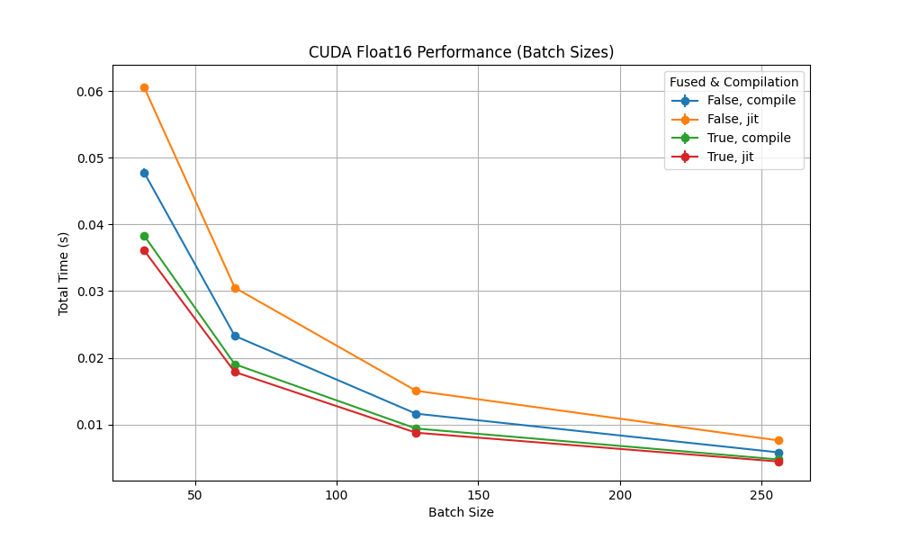
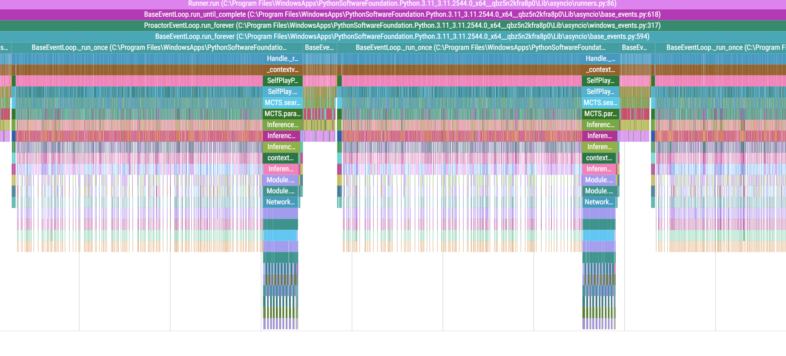

# Inference Optimization

With all the current optimizations, about 1700 inference calls per second are done by each Self-Player. Since we have a cache hit rate of 60-80%, this means only about 300-700 inference calls per second per Self-Player are actually done. We use 16 Self-Players per GPU, which means we have a total of 4800-11200 inference calls per second per GPU. This is still not enough to fully utilize the GPU, which is why we have to further optimize the inference pipeline. We cannot simply have more Self-Players per GPU, as the VRAM is running out (because each Player loads their own version of the Model) and each process requires the same cache, which also spikes the RAM usage (6GB per Self-Player). A central inference server should be used to handle caching and inference but the communication overhead on pervious implementations was too high (1700 * 16 = 27.200 requests/sec). Another approach can be tried using [ZeroMQ](https://zeromq.org/), which is a high-performance asynchronous messaging library, with local batching and caching to reduce the number of messages sent to the inference server. The inference server can then handle the caching and inference of the requests and return the results to the Self-Players. This way, the GPU can be utilized to its full potential and the inference throughput is maximized.

With all of this, the main bottleneck is the MCTS iteration, which currently requires 80% of the run time, simply because it has to rebuild the tree every time a new move is played, even though most of the new tree was already expanded in the previous iteration. Simply reusing the tree from the previous iteration would greatly improve the inference speed, but in preliminary testings, that caused wrong results, even if noise was added to the policy of the new node and a minimum visit count was required for all valid moves, so that no good move was missed. This is why the MCTS iteration has to be optimized further, so that the model inference is the main bottleneck and not the MCTS iteration.

## Torch Optimizations

Using torch optimization techniques like `torch.compile`, model fusing of Conv2d, BatchNorm2d and ReLU, as well as the use of `bfloat16` for the entire inference pipeline greatly improved the inference speed. The model was compiled with `torch.compile` and the model was fused with `torch.quantization.fuse_modules`. The model was then inferenced using `bfloat16`, which is a 16-bit floating point number with 8 bits of exponent and 7 bits of mantissa. This greatly reduced the memory footprint and increased the inference speed.

Additionally, parts of the MCTS search and data handling were compiled using `numba` and `njit`. This greatly improved the inference speed of the MCTS search and the data handling up to 30x.

## Caching

Lots of the evaluated states are initially the same, as the same board state can be reached by different move sequences as well as symmetries of the board or simply by parallel self-play games. By caching the results of the inference, the same state does not have to be evaluated multiple times. The cache is based on the canonical board state, which is the board representation from the perspective of the current player. To further improve the cache hit rate, the cache is also based on the symmetries of the board state, using the smallest key of the symmetries as the key for the cache. This has a cache hit rate of 50-90% depending on the game and the number of parallel self-play games. The more parallel self-play games use the same inference server, the higher the cache hit rate, which is the main reason for the architectural approaches tried.

Using Zobrist hashing, these board states can be hashed efficiently with small memory footprint and fast hashing. This greatly improved the cache hit rate and the inference speed.

## Batched Inference

To improve the inference throughput, the inference requests are batched and sent to the inference server. The inference server then performs the inference on the batched requests and returns the results. This greatly improves the inference throughput, as the GPU can perform the inference on multiple requests at once.

## Parallel MCTS Search via Virtual Loss

To achieve batching, multiple states have to be evaluated at once ([paper](https://dke.maastrichtuniversity.nl/m.winands/documents/multithreadedMCTS2.pdf)). One method to achieve this is to perform a parallel MCTS search. This is selecting the `k` highest ucb-score nodes and expanding them in parallel. Since selecting the nodes to expand is based on the ucb-score, naively expanding the nodes in parallel would lead to the same nodes being expanded multiple times. To prevent this, a virtual loss is added to the nodes that are selected for expansion. This virtual loss is then removed once the node is expanded. This way, the same node is not expanded multiple times and the MCTS search can be performed in parallel.

## Parallel Self-Play Games

Playing multiple games in parallel, each with their own parallel MCTS search, finally leads to our batch sizes being reached. This way, the GPU can be utilized to its full potential and the inference throughput is maximized. Hereby mutliple self-play games are started in parallel and each game is played until the end. The games are then written to a file and the next game is started. Since many games would be expanding almost the same moves, a deduplication step is performed, where the same state is not played twice in parallel self-play games. Rather than playing the same move twice, a different move is sampled from the MCTS search. This way, the games are more diverse and the model is trained on a more diverse dataset. In addition, we always keep a fixed size of games in parallel, meaning that as soon as a game finishes, a new game is started. This way, the GPU is utilized to its full potential and the inference throughput is maximized.

## Multi Self-Players per GPU

Since one self-player is not able to fully utilize the GPU, multiple self-players are started on the same GPU. This way, the GPU can be utilized to its full potential and the inference throughput is maximized. The self-players are started in parallel and each self-player plays multiple games in parallel. The games are then written to a file and the next game is started. This way, the GPU is utilized to its full potential and the inference throughput is maximized.

As can be seen in the graph, the self-play games are not able to fully utilize the GPU even remotely. This either requires further optimization of the self-play search or the use of multiple self-players per GPU.

## Multiple GPUs for Self-Play

Because the demand for training samples is so high and the generation of samples still takes a considerable amount of time, multiple GPUs are used in parallel with duplicated setups of many self-players per GPU. This way, the demand for training samples can be met and the training can be performed on a large dataset. The amount of GPUs used is based on the demand for training samples and the time it takes to generate the samples and the time it takes to train the model.

## Baseline Performance [Crazyhouse](https://ml-research.github.io/papers/czech2019deep.pdf)

Two GPUs were exclusively used for selfplay game generation and one GPU was used
both for game generation and updating the neural network as soon as sufficiently many
samples have been acquired. On a single GPU about 45 games were generated per minute
which corresponded to 1,000 training samples per minute. Each training sample was
produced by an average of 800 MCTS rollouts with a batch-size of 8.

Not all of the game moves were exported as training samples and exported as further
described in Section 5.2.1. A new neural network was generated every 819,200 (= 640 ·
128 · 10) newly generated samples. After the 10th model update, the number of required
samples was increased to 1,228,800 (= 640 · 128 · 15) samples. 81,920 (= 640 · 128) of
these samples were used for validation and the rest for training. Furthermore, 409,600
(= 640 · 128 · 5) samples were added and randomly chosen from 5 % of the most recent
replay memory data. The training proceeded for one epoch and afterwards, all samples,
except validation samples, were added to the replay memory.