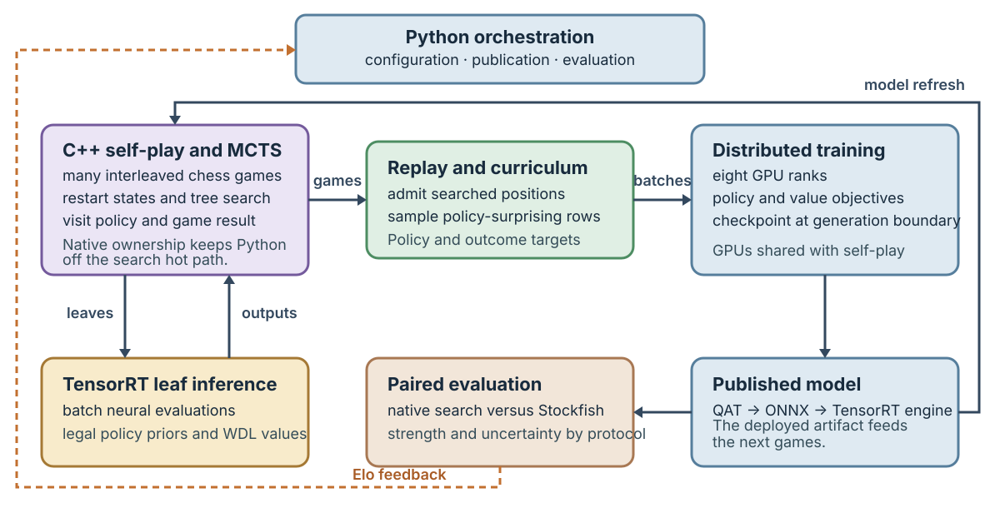

# 3. System and training method

## Runtime boundary

The implementation matters to the research question because the learner needs enough searched games and fresh
positions within the reported 2.5-day run. Figure 1 follows that loop from model publication through self-play,
replay, training, and evaluation. This chapter describes the interfaces that determine its throughput and targets;
Chapter 5 examines their measured costs.

Figure 1. A published model returns to batched native self-play; searched positions become replay targets for the
trainer. Paired evaluation measures the published checkpoint and feeds selection decisions back to Python. The
diagram shows ownership and data flow, not the number or scheduling of every worker.

Native C++ owns game state, legal actions, encodings, tree search, self-play, and batched inference. Python
coordinates validated configuration, workers, replay, distributed training, model publication, and evaluation.
There is no second production rules or search implementation in Python. Tests enforce the cross-language action
mapping, tensor shapes, feature planes, symmetry, and output order.

## Chess representation and outputs

The network receives a board-aligned tensor of current state, history, and additional chess features. Its reduced
action space has 1,880 chess actions; a game symmetry transforms the position and its action targets together. The
serving artifact exposes only policy and win/draw/loss value outputs. Auxiliary heads train the shared
representation but are absent from inference.

The retained network is convolutional, with scaled post-activation residual blocks, capped activations, and
global-pooling context in every second block. A from-to attention policy head scores move origins and destinations
more compactly than a dense action projection. The value path reduces to two channels before a small fully
connected layer. Chapter 4 examines the representation alternatives; Chapter 7 gives the selected shapes.

## Search and self-play

Self-play uses PUCT-style Monte Carlo tree search with neural policy priors and value estimates. Search visits follow
a staged fixed budget, rather than a budget adapted separately to each position. Root exploration uses Dirichlet
noise, reduced-parent-value first-play urgency, and forced playouts; a fraction of root visits is retained after a
move. Chapter 4 explains why the tested adaptive alternatives were not retained.

Thousands of games are interleaved to fill GPU batches. Native workers retain their trees; one inference worker
per process submits batches to TensorRT. Parallel simulations improve batch fill but can select leaves using stale
search information. Concurrent games can raise aggregate throughput while lengthening an individual game. The
chosen search and topology therefore form one operating point, not independent speed knobs.

Starting positions mix shallow random legal openings with archived restart states. Restart candidates favor
uncertain, consequential positions rather than uniformly sampling history. The random-opening share preserves games
that evolve from the opening, while restarts revisit positions where additional search may matter. Resignation is
enabled only after a calibrated false-nonloss gate is met; continuation games check the gate and retain terminal
examples.

## Replay and materialization

Native workers publish complete trajectories atomically. Parallel materializers reconstruct observations into
fixed-layout columnar shards; a circular memory-mapped store is the training replay. Search policies remain sparse
in storage and are densified only when a training batch is formed.

Each row retains the state, legal moves, search policy, WDL target, root value, sample weight, source generation,
policy-surprise information, and configured auxiliary targets. Exactly-once trajectory claims and rejection
telemetry protect the boundary between completed games and admitted replay rows.

Sampling mixes uniform draws with policy surprise: positions where search disagreed with the network prior are drawn
more often without losing broad coverage. Replay capacity grows in stages. A configured replay ratio ties optimizer
work to materialized positions, preventing training from silently outrunning data generation. Chapter 4 separates
the measured effects of these data choices from the integrated recipe.

## Training

Eight persistent NCCL trainer ranks, one per GPU, use a global batch of 2,048 in bfloat16. Training runs in
500-step optimizer blocks while some self-play workers remain active. Each training-and-publication cycle is called
a *generation*; a *checkpoint* is its durable model artifact. Because training and self-play overlap, fewer search
simulations do not necessarily shorten wall-clock training. This distinction is central to the adaptive-stopping
result in Chapter 4.

The primary objective combines policy cross-entropy with WDL/value loss. Outcome value is discounted by ply, and a
small scheduled blend of search-root value is introduced later. Two training-only targets—the next position's
search policy and normalized remaining game length—provide auxiliary learning signals. Search does not query them.

## Progressive models and publication

Training begins with a smaller network because its higher inference throughput supplies more early games. The
production controller trains the next larger candidate from an independent initialization alongside the active
model. A strength-improvement plateau triggers candidate training, while two qualifying head-to-head matches gate
promotion. Function-preserving growth from a trained medium model was tested separately, not as the controller's
ordinary path. Chapter 7 gives the selected schedule and gate.

Rank zero publishes both a recoverable training checkpoint and a trimmed inference artifact. The final path refits
quantization-aware-trained ONNX weights into TensorRT templates for self-play and evaluation. Numerical fidelity is
checked at publication; Chapter 6 describes the failure that made this check necessary.

## Evaluation

Short-lived evaluations run on a fixed cadence beside training. Fixed-dataset metrics and paired-opening Stockfish
ladders monitor policy-only and searched play. Terminal evaluation uses larger matches and deeper search budgets.
The run records the engine binaries, datasets, opening books, and their hashes as part of the protocol.

The training ladder brackets the candidate against nearby Stockfish node limits instead of extrapolating from one
opponent. Paired openings reverse colors, and reports retain W/D/L and search identity. Batch shape can alter
serving behavior, so it is part of the evaluation protocol. Frequent ladders provide a noisy progress signal; the
terminal paired matches in Appendix B support the final strength estimate.

Completed trajectories, replay state, checkpoints, and evaluation evidence are committed before they are credited
or reported. Appendix D states which artifacts are public and which remain in the local archive.
