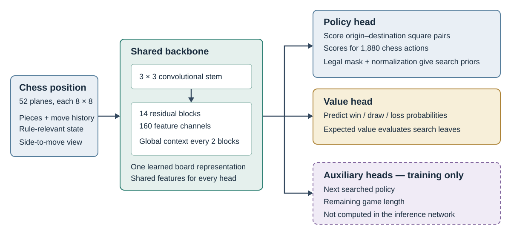

# 3. Background and system design

## Learning through search

AlphaZero learns a chess player without examples of human play [1]. Its network has two jobs: the *policy* assigns
probabilities to moves, while the *value* estimates the outcome of a position. Monte Carlo tree search (MCTS) brings
these predictions together. It explores moves using both their policy probabilities and the results found so far,
balancing promising continuations against less-explored alternatives. At a new leaf, the network evaluates the
position; that value is backed up along the path to inform subsequent exploration.

Search can therefore challenge the network's first impression. A promising move may reveal a strong reply for the
opponent, while a less obvious move may lead to better positions. The root visit distribution becomes a policy
target, and the completed game's outcome teaches the value prediction. Training folds this experience back into
the network. Better predictions then guide later searches towards more useful continuations, sustaining a cycle
of search, self-play, and learning.

This is the central opportunity under limited compute: spend search to discover improvements, then learn enough
from those improvements that the next search starts from a stronger player. Cheap searches that mostly repeat the
network's initial preference may produce many positions but little new policy information. Very deep searches
can make good targets too expensive to supply in sufficient quantity. The system must make both searching and
learning affordable.

## Related work

AlphaZero establishes the self-play learning framework [1]; KataGo shows how substantially its compute requirements
can be reduced through changes to search, training, and network architecture [2]. KataGo is the closest practical
precedent for this study's efficiency focus. Its fast/full search schedule, auxiliary objectives, and self-play
methods [7] motivated several investigations here. Their usefulness still depends on the game: completing more
long Go games and supplying more searched chess positions need not favour the same allocation of compute.

Several narrower lines of work address where that compute should go. Dynamic simulation MCTS studies when to stop
search [3], and targeted search control starts self-play from archived states to explore beyond ordinary opening
trajectories [5]. Prioritized experience replay changes which stored examples are learned from again [4], while
Monte Carlo graph search shares work across paths reaching the same state [6]. These ideas motivate the allocation,
replay, restart, and reuse experiments. This chapter explains the resulting system; Chapter 4 examines how the
alternatives performed, and Chapter 5 measures the throughput needed to run it.

## One learning cycle

The learning loop has three sources of work: actors play games, the replay pipeline stores their experience, and
the trainer updates the network. An *actor* is a self-play process that advances many games concurrently rather
than waiting for each game to finish before starting another. All those games use a published set of network
weights to guide their searches.

Figure 1 follows the flow between these components. Python orchestration starts and coordinates the work. Within
each actor, native C++ search requests policy and value predictions for newly explored positions. Requests from
different games are grouped into batches and evaluated on the GPU by TensorRT, the optimized inference engine.
While a batch is being evaluated, other ready games can advance. Returned predictions let the waiting searches
update their trees and eventually choose their moves.

Figure 1: Self-play turns a published network into searched games, replay supplies their positions to the trainer,
and updated weights return to the actors. Separate matches measure the player's progress.

A finished game supplies a sequence of positions, the search policy at each recorded move, and its final outcome.
The replay pipeline converts that sequence into training examples. The trainer draws batches from the accumulated
examples and adjusts the weights to better predict their policies and outcomes. After a block of optimizer steps,
publication prepares the updated network for the actors. The next games then benefit from what the learner has
absorbed.

Some actors keep playing while training runs, so the system can produce the next games while learning from earlier
ones. Evaluation runs alongside this loop using the native chess engine to play matches against Stockfish. These
matches measure progress; they do not become self-play training data.

## Why the search loop stays in C++

The language boundary follows the frequency of the work. One played move requires hundreds or thousands of tree
traversals. Each traversal may update a board, generate legal moves, select a continuation, encode a position, and
back up a value. If Python dispatches these steps individually, interpreter and boundary-crossing costs recur
throughout the most frequently executed part of the system. Even a fast GPU can then spend time waiting for the
CPU to prepare its next batch.

C++ owns the complete inner loop: game state, search trees, traversal, and the inference request pipeline. An actor
can retain its trees and buffers, interleave independent games, and submit batches without returning to Python for
each search leaf. After a move is played, the relevant subtree becomes the next root, preserving useful work rather
than rebuilding the search from nothing.

Python operates at a coarser scale. It coordinates processes, manages replay and publication, and trains the model
through PyTorch and its distributed libraries. These tasks benefit from the existing numerical ecosystem and ease
of experimentation without placing Python on the path of every simulation. The purpose of the split is not to make
every operation native: it is to keep the expensive repeated work fast enough to supply the learner with games.

## Chess representation and outputs

The network receives a chess position as an image-like stack of 8×8 arrays, called *planes*. A piece plane records
where a particular kind of piece is present; other planes encode recent moves and rule-relevant information such
as castling rights, en passant, repetition, and the fifty-move counter. Two identical-looking boards can have
different legal outcomes because of this information. The selected input contains 52 planes, expressed from the
side-to-move perspective so the network can reuse its representation for either player.

A convolutional neural network transforms these inputs into learned board features. Convolutions apply the same
small spatial filters across the board, initially combining nearby information. Successive layers build richer
relationships. The main feature extractor is a residual *backbone*, also called the trunk: each block learns a
correction to its input and adds that correction back to it. This gives a deep network a direct path for retaining
useful features while refining them. The final model has 14 residual blocks and 160 feature channels at each square.

Local filters are supplemented with global context. Every second residual block summarizes selected features
across the board and feeds that summary back into the spatial representation. A feature at one square can therefore
respond to the broader position, rather than depending only on information that has propagated through neighbouring
squares. Figure 2 shows how this common board representation feeds the output branches.

Figure 2: The final chess network. A shared 14-block, 160-channel backbone processes 52 input planes. Policy and
value heads provide the predictions used by search; the two auxiliary heads contribute only during training.

A *head* is a small output branch attached to the shared backbone. The policy and value heads see the same features,
but ask different questions about them. Their training losses both update the backbone, allowing the common
representation to support move selection and position evaluation without computing two separate networks.

The policy head asks which legal moves are promising. The retained from-to design forms a learned representation
of each square as an origin and as a destination, then scores origin-destination pairs. Promotion scores distinguish
moves that share those squares but promote to different pieces. A fixed mapping collects these scores into the
1,880-action chess interface. Illegal actions are masked out and the remaining scores are normalized into move
probabilities. The result is the prior that tells search where to begin looking; it is not yet the searched policy.

The value head asks how the position is likely to end. It predicts three probabilities: win, draw, and loss (WDL).
For search, the expected value is the win probability minus the loss probability, ranging from -1 to +1 for the
player to move. Retaining the full distribution during training also lets the model distinguish a likely draw from
a mixture of winning and losing possibilities with the same expected score.

Two additional heads predict the next searched policy and the remaining game length. These are *auxiliary tasks*:
the completed game provides their labels, and their errors help train the shared features. Search needs neither
output to select a move, so the inference copy includes only the backbone and the primary policy and value heads.
This saves the work of computing auxiliary outputs in every simulation while retaining what their training taught
the shared representation.

## Search and self-play

At each move, search builds a tree whose root is the current position. A traversal starts at that root and selects
moves until it reaches a position that needs evaluation. Selection combines the value found for a move with an
exploration bonus based on the network's prior and the move's visit count. This PUCT rule favours moves that look
good, but also gives promising, less-explored moves a chance to improve their estimate.

The network supplies a policy and value for a new leaf. If the position is already terminal, the game rules supply
its result instead. Backup then updates the visits and accumulated values along the selected path. Because players
alternate, a favourable result for one side is unfavourable for the other. Repeating this process gradually shifts
attention towards continuations that survive examination of the opponent's replies.

For example, the network may initially prefer a move that wins a pawn. Search can discover that the opponent then
has a dangerous reply, lower its estimate of that continuation, and spend more visits on a safer alternative.
The training signal is not just which move was finally played: the distribution of root visits records the search's
relative preference across the available moves. That distribution becomes the policy target.

Self-play must explore as well as exploit its current knowledge. Noise added to the root prior makes games consider
different continuations, and a temperature setting controls how sharply played moves follow the visit leader.
The search budget rises in stages from 300 to 800 visits as training progresses. Useful visits from the retained
subtree contribute to the next move, while each new search refines the choice from its new root.

Many independent games share inference batches. This uses the GPU efficiently without requiring every tree to
search multiple leaves at once. When per-tree parallelism is used, several traversals can be waiting for results
simultaneously; temporary reservations discourage them from all choosing the same path. They still make their
choices without the other pending results, creating the strength-versus-latency tradeoff examined later.

Games need not all repeat the ordinary initial position. Roughly half start after a short random legal opening,
and the other half use archived self-play positions with interesting alternatives left to explore. A restart plays
a different branch from such a position, creating new experience rather than simply replaying its old target.
Ordinary starts maintain whole-game coverage while restarts spend some of the budget on unresolved choices.

Games normally supply win, draw, or loss labels when they end. Resignation avoids spending search on clearly lost
positions, but some games are forced to continue so the system can estimate how often resignation would be wrong.
A maximum game length also prevents extremely long games from consuming unlimited compute. At that limit, one
final full search estimates the unfinished position's value instead of assigning it an arbitrary result.

## Replay and materialization

Training only on the latest game would expose the network to a narrow, highly correlated sequence of positions.
A *replay buffer* keeps examples from many completed games so each optimizer batch can mix different openings,
middlegames, and endings. Reusing this experience also allows several training presentations per newly searched
position rather than requiring another expensive game for every update.

Each example stores the encoded position, its legal actions, the searched policy, and an outcome target. For a
finished game, the outcome is expressed from the side to move at each stored position. For a capped game, the final
searched estimate supplies a substitute target. Random opening moves and reconstructed restart prefixes have no
search policy of their own, so they are not treated as searched training examples.

*Materialization* is the conversion from complete game trajectories to these rows. The rows live in a circular
memory-mapped store: as the active window fills, new examples replace its oldest contents, and trainers read batches
without loading the whole buffer into each process. Search policies are stored sparsely, retaining the actions
with visit mass rather than writing a full mostly empty vector for every position.

Replay capacity grows from 600,000 towards 20 million positions. The small early window lets new experience quickly
replace the weakest early play; the larger later window preserves more variety. Sampling combines a uniform
component with a preference for positions where search changed the network's move probabilities substantially.
Such positions offer a plausible learning opportunity, while uniform sampling prevents the learner from seeing
only unusual or difficult cases. Each selected row has the same loss weight; priority changes how often it is seen.

Data supply also sets the pace of training. The chosen reuse ratio permits four training presentations per new
replay position. A 500-step block with a batch of 2,048 therefore requires 256,000 new positions to support its
1,024,000 presentations. If the actors have not supplied enough, training waits. This keeps a faster optimizer
from merely making more passes over an unchanged pool of experience.

## Training

A training batch asks the network to reproduce what was learned through play. The policy loss compares its move
probabilities with the search visit distribution, rewarding probability placed on moves that search favoured.
The value loss compares its WDL prediction with the stored outcome target. Both losses send gradients through their
heads into the common backbone, updating the features used by the next round of searches.

The outcome target is softened for positions far from the end of a game, where later mistakes can separate the
position's promise from its eventual result. A small contribution from the position's searched value is also blended
in during training. These targets give the learner both the game's longer-term outcome and some local search
information. The auxiliary losses add next-policy and remaining-length supervision when those labels exist.
An unfinished game cannot reveal its true remaining length, so that auxiliary loss is omitted rather than trained
towards a fabricated zero.

Eight GPU processes train with distributed data parallelism (DDP). Each computes losses and gradients on its portion
of a global batch of 2,048; their gradients are combined so the model receives one shared update. The optimizer
uses those gradients to adjust the weights, and gradient clipping limits unusually large updates. A learning-rate
schedule controls how large the updates are as training progresses.

Updates are grouped into blocks of 500 optimizer steps. A block followed by publication is a *generation*, and a
saved set of model weights is a *checkpoint*. Half the self-play actors continue working while a block runs.
This overlap is valuable because game production and training use the shared hardware differently, but also means
that saving search work will shorten the full cycle only when search was delaying the next block.

## Progressive models and publication

Starting with the final model size would spend its full inference cost even while the player is still learning
basic chess. Progressive sizing starts with a smaller, faster network. Its searches are cheaper, supplying more
games during this early stage. As improvement slows and model capacity becomes more limiting, a larger network
can make better use of the experience already collected.

The ordinary transition trains a larger candidate on the same replay alongside the active model. Since the
candidate starts independently, it first needs catch-up training before it can replace an already competent player.
Paired head-to-head matches test whether it has caught up. These matches decide the occasional change in model
size; they are not a gate applied to each routine training update. Within an active size, updated weights are
published after training blocks without requiring them to defeat the previous generation.

A second approach initializes the larger network to reproduce the smaller network's current predictions. This
function-preserving growth avoids much of the initial catch-up, but may also keep learning close to the smaller
model's internal representation. The final reported player uses the successful small-to-medium path; the limited
larger-model continuation did not establish a further strength gain.

Publication bridges training and inference. Training retains optimizer state and auxiliary heads, while
search needs only a fast policy-and-value predictor. A separate inference copy removes those unused heads and
combines operations where possible. It is exported through ONNX, a model representation that TensorRT can compile
into an optimized GPU engine. Refitting replaces weights in a prepared engine rather than rebuilding it after every
training block.

Most backbone convolutions use eight-bit integer arithmetic to accelerate inference. Quantization-aware training
simulates the rounding and clipping this introduces, letting the network adapt before deployment. The exported
copy is checked against the training model on representative positions so the speedup does not silently change
its move preferences or value predictions. Once prepared, it becomes the model used by subsequent self-play.

## Evaluation

Training loss shows how well a network fits replay, but fitting those examples is not the same as playing stronger
chess. Evaluation therefore plays separate matches against fixed-node Stockfish opponents. Each opening is played
twice with colours reversed, reducing the influence of which side received the easier starting position. Wins,
draws, and losses determine the match score and its implied rating on the project's calibrated ladder.

During training, short 64-search and policy-only evaluations track progress at modest cost. They answer different
questions: policy-only play tests the network's immediate move choice, while searched play tests how useful its
policy and value are together in a tree. Larger final matches repeat the assessment across increasing search
budgets, as reported in Table 1.

The resulting feedback completes the experimental loop. A change that improves a local loss or throughput measure
still has to help produce a stronger player within the available training time. The following chapters use this
system description to examine those choices, rather than treating local speed or fit as an end in itself.
