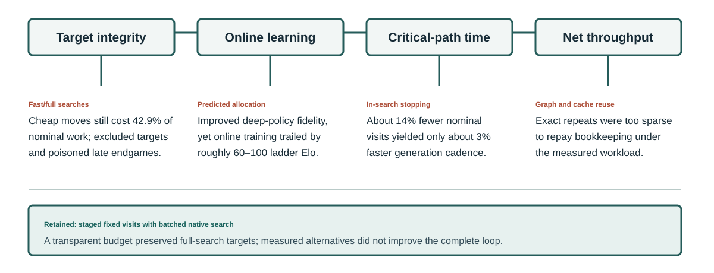

# 4.1. Spending search where it matters

More search makes an individual move stronger. With the same frozen network and opponent, raising the budget from
200 to 1,600 visits raised its match score from 0.318 to 0.748. Training poses a different question: could some
moves use fewer visits so that self-play finishes more games without teaching the next model worse policies? Cheap
moves might save computation, but the saved work matters only if it increases useful training data or shortens the
learning cycle.

We tried fast/full searches, several ways to allocate or stop search according to position, and reuse through a
graph or inference cache. The retained approach increases a fixed visit cap in stages and applies that cap to every
recorded move. The experiments below distinguish four tests that can give different answers: immediate move
strength, agreement with a deeper policy, strength of the next trained model, and throughput.

Figure 2: Fast/full search damaged target coverage and endgame semantics; predicted allocation improved target
fidelity but lost online strength; in-search stopping saved mostly non-critical-path work; and exact graph or cache
reuse failed to repay overhead in this workload.

## The fixed-budget baseline

The native engine performs policy-guided Monte Carlo tree search. The network supplies legal-move priors and a
win/draw/loss value; PUCT selects leaves; neural evaluations are batched across active games; and values are backed
up from the alternating player's perspective. A fixed visit cap gives each recorded move the same search budget
within a training stage.

Against the same opponent, score rose from 0.318 at 200 visits to 0.537, 0.580, 0.662, and 0.748 at 400, 600,
1,000, and 1,600 visits. Across the better-resolved middle and deep part of the sweep, the fitted trend was about
81 Elo per doubling. Individual adjacent comparisons were noisy, so the overall trend is more credible than any
single increment. Search was still changing its policy target too: at 600 visits, only 72.4% of positions selected
the same best move as the network's own 10,000-visit reference. These frozen-network measurements establish the
value of search depth, not an optimal training schedule.

The cap increased in stages—300, 400, 500, 600, and finally 800 visits. These boundaries were not each optimized
independently. A retained root may start a move with existing statistics, so its nominal visit cap can exceed the
new work performed.

## Why fast and full searches did not transfer

A scheme inspired by KataGo's self-play methods [7] used cheap searches to advance most moves and full searches on
a random minority, which alone became primary policy targets. The trade is attractive in 19×19 Go: long games make
finished outcomes expensive, so cheap moves can supply more independent value targets. Chess games are shorter,
their outcomes and positions are often clearer, and the value objective was already learning. The transferred
recipe thus spent search on moves whose positions were discarded as primary training rows without showing that the
extra completed games compensated for the lost policy-target density.

The cheap moves were not free. With a quarter of moves searched to 600 visits and the rest to 150, the cheap moves
still consumed 42.9% of nominal search work. Nor were they isolated from training: they selected played moves,
affected terminal outcomes and retained trees, could supervise a preceding row's next-policy target, and influenced
which positions entered the restart archive. “Not stored as a primary policy row” was never the same as “irrelevant.”

The mixed workload also interacted badly with batching. Once the cheap searches finished, only the full-search
minority remained. In a 512-game test this tail left about 128 active trees and filled only 86 of 320 available batch
slots with one leaf per tree. Allowing four leaves per tree raised the average batch to about 268 and improved search
throughput by roughly 20%, but it did so by making each search less serial. A policy intended to save compute thus
created pressure to accept a search-quality tradeoff merely to keep the accelerator occupied.

Most importantly, a forced cheap-search tail made the endgame failure self-reinforcing. It removed searched
endgame rows because cheap moves were not admitted as primary targets. A shallow estimate at the ply cap could then
be propagated through many earlier rows of the same game. The original motive was reasonable—avoid filling replay
with noisy positions from very long endings—but it also withheld the examples needed to learn conversion. One
full search at the cut position replaced the heuristic bootstrap; later, removing the cheap tail restored searched
endgame positions. Because multiple changes accompanied the observed recovery, the record does not isolate either
repair as its sole cause (Chapter 6).

The retained design searches every recorded move to the scheduled cap. The decision follows from target coverage
and throughput under this workload; a long-run matched-compute strength comparison was not preserved.

## Three attempts to allocate search adaptively

The first attempt asked whether search could stop when the visit leader looked uncatchable. An audit of completed
trees found apparent room: an optimistic reconstruction suggested that a rule requiring at least 75% of the cheap
budget might remove 15.3% of cheap-search visits, or 6.38% of all nominal limits if full searches saved nothing.
But the records contained final visit distributions, not the intermediate traces needed to identify when the leader
first became safe. They also omitted enough state to reconstruct retained visits and forced-playout-pruned targets.
The apparent saving was therefore an oracle-like opportunity estimate, not an observed stopping result.

A wider offline study found a deeper problem. The marginal value of search was not monotone in visit concentration:
very diffuse and already-decided positions gained little, while moderately concentrated but contested positions
gained most. Simple concentration thresholds tended to stop in the very region where more search was useful. The
rule-based approach was therefore declined before an online strength match.

The next allocator replaced the rule with a learned prediction, related in aim but not identical to
dynamic simulation stopping [3]. An auxiliary head estimated, for several candidate
budgets, the divergence between that budget's policy and a deep-search policy. A calibrated corrector incorporated
root observables, and a dual variable kept average spend near its target. Deep labels, replay persistence, model
publication, native budget selection, safety gates, and telemetry were all implemented. Mechanically, the system
worked. At approximately matched mean spend it captured about 23% of the available policy-divergence headroom; its
mean target fidelity resembled roughly 1.18 times uniform search at 0.967 times the spend. It also behaved plausibly,
assigning more work to contested positions.

Learning nevertheless deteriorated. Repeated online attempts trailed comparable non-adaptive training by roughly
60–100 ladder Elo. More than a third of positions received an average budget fraction near 0.36, and almost 9%
received one eighth of baseline search. Those shallow policies were close to the network's own prior yet were
trained at full weight. The likely failure was therefore objective mismatch: closeness to a deep policy at the
current position does not measure how much a target will improve the next network. That mediation remains a
hypothesis, but the central result does not: the controller improved its stated proxy and still produced worse
learning.

The final adaptive system moved the decision inside search, where a learned stopper could observe the evolving tree
rather than predict difficulty in advance. Its decisive test started from the same checkpoint, optimizer, and
rebuilt replay state for every arm. The most aggressive setting skipped about 14% of nominal search, and its
internal credit-wait measurements changed in the expected direction. Yet generation cadence improved by only about
3%. Self-play overlapped the optimizer, so most of the removed search was slack rather than critical-path work.
The paired strength differences, calculated as baseline minus stopper, were +1.7 ± 9.9 Elo and -4.2 ± 10.1 Elo
(standard errors) for the two settings: neither resolved a strength effect. At the observed learning rate, the cadence
gain was worth only about one Elo over three hours,
below the experiment's resolution.

The three approaches failed for different reasons. The threshold rule lacked an identifiable safe signal; the
predicted allocator improved policy fidelity but not learning; and the in-search stopper removed mostly
off-critical-path work. In a non-overlapped or inference-bound learner, that last tradeoff may change.

## Parallel leaves: buying latency with search quality

Batching across many independent games is the cleanest way to feed the accelerator, but the number of active roots
eventually runs out. The engine can then keep several leaf traversals in flight from one root. Virtual reservations
discourage those traversals from selecting the same path, yet every selection is based on a tree that is missing the
other in-flight results. Parallel search is therefore not serial MCTS executed faster. It exchanges fresher
decisions for larger batches and lower latency.

The experiments exposed how easy it is to measure the wrong regime. An initial sweep suggested little cost per
doubling, but its batch capacity was too small relative to the number of trees, so the configured per-root
parallelism barely bound. A deliberately oversized-batch rerun activated the knob and estimated a steeper
-6.4 ± 4.7 Elo per doubling. The interval still included a small effect, and the rerun was diagnostic rather than a
production throughput configuration.

The tradeoff also depended on the total budget. At 1,000 searches, a terminal fixed-network sweep measured point
losses of 19 Elo with four leaves and 45 Elo with sixteen leaves relative to serial search, while sixteen-way
parallelism was substantially more damaging at 100 searches. The likely explanation is that a deep search will
eventually visit more of the temporarily suboptimal leaves selected from stale state. However, only a few budget and
parallelism combinations were measured, and the terminal strength curve itself uses different parallel counts at
different depths. It is not a pure scaling curve from which a universal safe-parallelism law can be inferred.

The retained design uses bounded parallelism as a serving parameter rather than a free algorithmic speedup.
The right setting depends on available independent roots, batch capacity, total search depth, latency requirements,
CPU load, and memory. Older results from the fast/full batching tail do not directly prescribe the topology of the
final all-full workload.

## When a tree became a graph

Chess appears rich in transpositions: different move orders often reach the same board. The project tested whether
Monte Carlo graph search, as in Czech, Korus, and Kersting [6], could share neural evaluations, descendants, and
search statistics across those paths. Canonical nodes held shared state information while parent/action edges kept
local PUCT statistics. The implementation handled backup corrections, cycles, rerooting, and pruning; an audit
against the reference implementation corrected a missing first-link backup behavior before the final measurements.

The limiting fact was chess-state identity. Pieces and side to move are not enough: castling rights, en-passant
state, the halfmove clock, and repetition-relevant history can change the legal result. Merging positions that differ
on those fields would create an approximate algorithm with different game semantics. Under exact equality, most
apparent board transpositions disappeared.

At ordinary budgets, verified links were absent or negligible. After the first-link correction, only 0.0249% and
0.1769% of neural evaluations were avoided at 1,000 and 10,000 searches, while the graph was 8.63% and 8.28% slower.
At 30,000 and 60,000 searches, table hits rose to 2.37% and 3.46%, but avoided evaluations remained approximately
0.0001% and 0.0348%; throughput was still 7.06% and 5.76% lower. Structural counters confirmed that shared
descendants and statistics were active. Exact reuse was orders of magnitude too sparse to repay the bookkeeping
cost in this implementation, so it was not taken to a final strength match.

## Why inference caching found little to reuse

Inference caching asked a narrower question: if an identical encoded neural input reappears under the same model,
can its policy and value outputs be reused without sharing search state? Two investigations answered complementary
parts of it.

First, a real bounded, sharded cache was shared by the search threads within each self-play process. With eight
processes per GPU, three search threads per process, and capacity for 1.5 million entries per process, its hit rate
was 0.970%. Disabling the cache made game updates about 0.88% faster in the short stochastic comparison and reduced
summed worker peak memory by about 7.12%. The implemented cache consumed memory without demonstrating a speedup.

A later audit measured the upper bound available to a wider cache before building one. An unbounded tracker shared
across one search executor observed exact encoded inputs but deliberately evaluated every position. With diverse
starts and production-style progression, repeats were 1.33% at 150 searches, about 4.24% at 800, and about 3.5% in
the mixed workload; same-batch duplicates were essentially absent. Following retained trees for several moves
raised the rate only to roughly 4%. The tracker itself cost about 3.65% throughput and grew without bound. A real
cache would additionally pay for output storage, synchronization, eviction, and device transfers while retaining
fewer entries.

The wider design was declined before implementation. Together with the implemented per-process cache, its
opportunity audit showed little reuse available under this workload.

## The retained search design

The selected system returned to fixed visits, but not to a bare or naive search. It uses PUCT, reduced-parent-value
first-play urgency, root noise and temperature for self-play exploration, forced root playouts followed by pruning
of visits that should not become policy supervision, batched native inference, a 0.99 per-ply value discount, and
tree retention with 60% of visits carried across a played move. Every recorded move receives the current staged
visit cap. The current settings are summarized in Chapter 7 and defined by the public configuration [10].

Search depth has direct strength and target-fidelity evidence, while parallel leaves have a measured
quality/latency tradeoff. Root retention, forced playouts, noise, discount, and the PUCT constants complete the
retained AlphaZero-style search recipe.

Fixed visits kept target provenance and search expenditure clear, while the tested alternatives failed to improve
learning under this chess workload. Repetitive analysis or a non-overlapped learner could change the economics.
