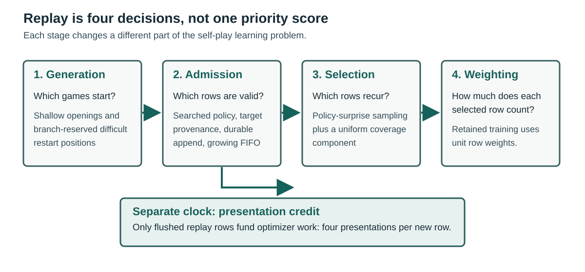

# 4.2. Getting more learning from each game

Once self-play finishes a game, the learner has to decide what it can learn from that game and when to see those
positions again. It can start future games from an interesting branch, admit searched positions to replay, and
revisit positions where search corrected the network's move preference. These choices do different jobs: a restart
creates new experience, while replay sampling reuses experience already collected. A game stopped at the ply cap
also needs a trustworthy value target because its actual outcome is unknown.

Figure 3 follows the route from a starting position to a training batch. We then examine how the system creates
games, stores their searched positions, and decides which positions to revisit.

Figure 3: Starting positions shape the games that are played. Their searched positions enter replay, where
sampling determines which examples the learner revisits. New examples also set the pace of optimizer updates.

## Starting games where information is likely

The start mixture tackles two coverage problems. Half of games begin after a uniformly selected zero to eight
random legal plies. These prefixes diversify the opening cheaply; they are reconstructed in the recorded history
but not searched or trained directly. Drawing zero plies also keeps some games at the ordinary initial position.

The other half begin from archived self-play states, falling back to random openings when a worker's restart
archive is empty. The archive favors positions with a meaningful unresolved alternative: they are not near the end
of the source game or already decided, and search found a small set of plausible moves. A restarted game chooses an
untried branch, reconstructs the prefix, then explores the alternative the source game did not play. Appendix D
gives the eligibility thresholds.

The archive gives 30% probability to uniform selection. Otherwise it favors positions where search substantially
corrected the network's value estimate, while softening the priority so one extreme position cannot dominate. Age
and capacity bounds remove old states, and exhausted positions leave the archive. Archives are local to workers.

Starting from archived states follows the search-control idea studied by Trudeau and Bowling [5]. Here, observed
search disagreement and untried branches guide the archive. Playing those branches creates new trajectories;
the replay sampler below instead chooses which existing positions recur during training.

## What becomes a training position

Not every move in a recorded game has a search target. Random opening-prefix moves and the reconstructed prefix of
a restart game were played or replayed to reach a starting position; they were not searched and create no replay
row. A normal searched move does. A final search performed only to value a cut position can also become a row even
though it selects no played action. Sparse policy storage retains at most 60 actions and records how much visit
mass was discarded. These rules determine the data set before sampling or weighting can act on it.

## Replay is both memory and clock

A replay window has to retain enough varied positions without teaching from very old play forever. A small window
forgets early policies quickly, but also forgets openings and endgames that have not recently appeared. A large
window preserves breadth while keeping older targets alive. The system therefore begins with a small logical
window and expands it as new games fill the store; merely reserving twenty million slots would not create twenty
million distinct positions.

The physical memory map is preallocated once, while its logical capacity grows from 600,000 to 20 million rows.
The early window stays small when little data exists; later growth preserves more openings, endgames, and policy
history. In an earlier campaign, playing strength continued to improve after fixed-dataset policy accuracy largely
saturated, reinforcing the value of fresh and varied positions. Appendix D gives the full capacity schedule.
Figure A.7 shows how the occupied window and sampled-position age evolve together during the final training.

Replay reuse introduces a second tradeoff. The configured ratio is the number of optimizer presentations funded by
each newly admitted row. In the retained setting, four presentations are credited per row; a 500-step quantum at a
global batch of 2,048 therefore requires 256,000 newly appended rows. Only positions that have actually reached
the replay store count towards this allowance.

Higher reuse funds more updates from each game; lower reuse gives each update fresher positions if the actors can
supply them. Short controls at ratios four, 6.25, and eight showed similar strength despite different update rates.
The selected ratio of four favors freshness. Appendix C gives the duration and scope of these short controls.

## Choosing which positions recur

Search disagreement suggests an opportunity to learn beyond the network's initial move preference. Within the live
window, the sampler therefore favors rows with high *policy surprise*: divergence between search's visit
distribution and the network prior. Seventy percent of draws follow this signal, capped at 2.0 so extreme rows
cannot dominate; the remaining 30% are uniform to preserve coverage. A row can recur across optimizer steps but is
drawn only once within a global batch. This is related to prioritized replay [4], though it uses a different signal.

The priority deliberately changes which positions dominate training. It is not corrected back to uniform sampling.
Because surprise can also reflect search noise or old targets, the uniform component preserves broader coverage.

Sampling a position more often is different from giving it a larger loss weight each time it appears. The final
recipe does the former: every sampled row has weight 1.0. An earlier replay design used weights to represent the
multiplicity of merged duplicate positions, but that is not how the retained policy-surprise sampler works.

## Ending games without corrupting their labels

Resignation can save a large amount of search, but a false resignation turns a drawable or winning position into an
incorrect terminal label. A fixed value threshold was therefore replaced by continuing measurement. Twenty percent
of games are designated at creation as continuation games and can never resign. They reveal the outcomes of
hypothetical triggers for thresholds from -0.99 through -0.70. A trigger requires both the root value and the best
visited child's backed-up value to cross the threshold; evidence from capped games is excluded because their natural
outcome remains unknown.

These continuation games answer a concrete question: how often would a proposed resignation have thrown away a
draw or win? The threshold needs at least 100 such examples, with a one-sided 95% upper confidence bound on that
error rate no greater than 2.5%. It can become more conservative immediately but relaxes by at most 0.01 per
publication. Continued measurement matters because a threshold suited to one model may not suit its successor.
Figure A.8 shows the threshold, rolling audit, and estimated saved plies during the final training.

A ply cap creates a harder target problem because there is no observed result at all. The project compared material
heuristics, raw network value, values from adjacent searches, and a fresh search at the cut position. Playing games
beyond the normal cap supplied later outcomes for evaluation. Brier score measures squared probability error,
while cross-entropy penalizes assigning low probability to the eventual outcome; lower is better for both.
At the earlier measured checkpoint, the cut-position
search achieved Brier score 0.444 and cross-entropy 0.756, compared with 0.491 and 0.851 for material divided by 39.
At the later checkpoint the corresponding scores were 0.193 and 0.374 versus 0.388 and 0.707. Search-root sign
accuracy exceeded 98% in both cohorts; calibration, not merely sign, distinguished the targets. The retained worker
therefore performs one full search at the actual cut position and uses its root value as the bootstrap.
The root value becomes a soft win/draw/loss target, then materialization applies the configured per-ply blur.
Appendix D gives the conversion.

The cut policy addresses the most damaging data failure found in the project. A cheap-search tail excluded late
positions from primary replay while a shallow cutoff estimate supplied the value target for earlier rows in the
same capped game. This plausibly reinforced weak conversion: fewer searched endgame examples, more capped games,
and more weakly grounded targets. Replay eviction could remove the offending rows without undoing their effect on
the network. Chapter 6 examines the incidence and repair. Deciding which positions to train on and deciding how to
label an unfinished game therefore cannot be treated independently.

## Learning from outcomes and intermediate predictions

An eventual game result supplies supervision without an external teacher, but it can be a noisy description of an
earlier position. A winning position may still be lost through a later mistake. The retained target therefore
becomes less certain the further it lies from the outcome: its win/draw/loss distribution is blended towards uniform
by a factor of 0.998 per remaining game ply. A scheduled contribution of up to 10% from the stored search-root
value also brings in the search's assessment of that particular position. This differs from the 0.99 discount
inside search, which affects which continuations the player prefers rather than how the completed game is labelled.

The completed trajectory also provides two auxiliary tasks: predict the next searched policy and the remaining
game length. These encourage the shared representation to capture how play develops, not just the current move.
They require care when games end early. A next-policy label exists only if there is a following searched
observation, and a capped game cannot reveal its true remaining length. Missing labels are excluded from the
corresponding loss rather than replaced with zeros, which would teach a false answer.

Broader auxiliary bundles were set aside while diagnosing several simultaneous training problems, not because a
controlled ablation found them harmful. Future-derived labels must come from complete trajectories and be masked
whenever the future is unknown.

## Fresh targets versus fresh positions

Reanalysis offers another use of search: revisit stored positions with the latest network and replace their old
policy targets. This can refresh useful examples, but it competes with playing new games that add both new positions
and outcomes. A bounded synchronous implementation existed in an earlier replay design; it was not retained when
that design was replaced, and its learning return was not compared with fresh self-play.

Publishing the latest model more often can also make targets fresher, because self-play then uses more recent
predictions. Doing so every 100 optimizer steps spent too much time saving, exporting, checking, and activating
models. The retained 500-step interval reduces that overhead while still refreshing the actors regularly.

## Overlap without full asynchrony

The actors and trainer share the GPUs. Pausing all actors gives the trainer more compute, but no new games arrive;
keeping every actor running slows training. The retained compromise keeps half the actors active during each
500-step training block. Models are still published at coordinated boundaries rather than changing underneath an
ongoing search. Chapter 5 compares how much search and training this overlap supports.

## The retained data strategy

The retained strategy keeps both breadth and focus. Ordinary starts preserve whole-game coverage, while restarts
explore alternatives worth revisiting. A growing replay window keeps a wider history, and priority sampling returns
the learner to positions where search changed its view. Fresh-game supply limits how often those stored examples
are reused. Resignation and cutoff handling then save search without casually inventing labels for unfinished play.

These choices are coupled: producing more rows is useful only if they contain information the learner needs and
targets it can trust. The endgame failure in Chapter 6 demonstrates what happens when that connection is broken.
