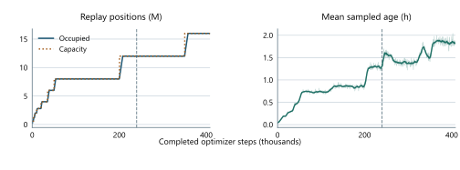
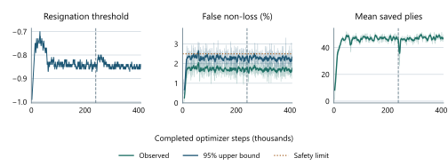

# 4.2. Getting more learning from each game

The data strategy determines both the distribution of self-play experience and its contribution to learning.
Restart states direct new games towards unresolved alternatives; replay capacity and sampling determine which
searched positions remain available and how often they are trained on. Resignation and cutoff handling affect
the reliability of their outcome targets. Figure \ref{fig:replay-decision-path} distinguishes these decisions along the path to a training batch.

Figure: Starting positions shape the games that are played. Their searched positions enter replay, where
sampling determines which examples the learner revisits. New examples also set the pace of optimizer updates.

## Restart-state selection

The start distribution combines opening diversity with targeted exploration. Half of games begin after a uniformly selected zero to eight
random legal plies. These prefixes diversify the opening cheaply; they are reconstructed in the recorded history
but not searched or trained directly. Drawing zero plies also keeps some games at the ordinary initial position.

The other half begin from archived self-play states, falling back to random openings when a worker's restart
archive is empty. The archive favors positions with a meaningful unresolved alternative: they are not near the end
of the source game or already decided, and search found a small set of plausible moves. A restarted game chooses an
untried branch, reconstructs the prefix, then explores the alternative the source game did not play. Appendix \ref{app:D}
gives the eligibility thresholds.

The archive gives 30% probability to uniform selection. Otherwise it favors positions where search substantially
corrected the network's value estimate, while softening the priority so one extreme position cannot dominate. Age
and capacity bounds remove old states, and exhausted positions leave the archive. Archives are local to workers.

Starting from archived states follows the search-control idea studied by Trudeau and Bowling [5]. Here, observed
search disagreement and untried branches guide the archive. Playing those branches creates new trajectories;
the replay sampler below instead chooses which existing positions recur during training.

## Replay admission

Replay admits searched positions, including a final search used to evaluate a capped game's endpoint. Random
opening moves and reconstructed restart prefixes have no search target and are excluded. Admission does not depend
on ply: searched endgame positions remain eligible throughout the game. Sparse policy storage retains at most
60 actions per position and records the discarded visit mass.

Figure: Replay occupancy follows the expanding capacity during final training. The mean age of sampled positions
grows to roughly two hours; age is measured from position creation. Both horizontal axes show completed optimizer
steps in thousands. The dashed line marks the small-to-medium model transition.

## Replay capacity and reuse

The capacity experiments addressed the diversity–age tradeoff introduced in Section \ref{sec:03-system-and-methods-replay-and-materialization}.

The physical memory map is preallocated once, while its logical capacity grows from 600,000 to 20 million rows.
The early window stays small when little data exists; later growth preserves more openings, endgames, and policy
history. In an earlier campaign, playing strength continued to improve after fixed-dataset policy accuracy largely
saturated, reinforcing the value of fresh and varied positions. Appendix \ref{app:D} gives the full capacity schedule.
Figure \ref{fig:appendix-replay-age} shows replay occupancy and sampled-position age during final training.

Replay reuse introduces a second tradeoff. The configured ratio is the number of optimizer presentations funded by
each newly admitted row. In the retained setting, four presentations are credited per row; a 500-step quantum at a
global batch of 2,048 therefore requires 256,000 newly appended rows. Only positions that have actually reached
the replay store count towards this allowance.

Higher reuse funds more updates from each game; lower reuse gives each update fresher positions if the actors can
supply them. Short controls at ratios 4, 6.25, and 8 showed similar strength despite different update rates.
The selected ratio of 4 favors freshness. Appendix \ref{app:C} gives the duration and scope of these short controls.

## Policy-surprise sampling

The retained sampler assigns seventy percent of draws to policy surprise, capped at 2.0 so extreme rows
cannot dominate; the remaining 30% are uniform to preserve coverage. A row can recur across optimizer steps but is
drawn only once within a global batch. This is related to prioritized replay [4], though it uses a different signal.

The priority deliberately changes which positions dominate training. It is not corrected back to uniform sampling.
Because surprise can also reflect search noise or old targets, the uniform component preserves broader coverage.

Priority acts through sampling frequency, not through per-example loss weights: every sampled row has weight 1.0.
An earlier replay design instead weighted merged duplicate positions by their multiplicity.

Figure: Resignation threshold, observed false-resignation rate and its one-sided 95% upper bound, and estimated
saved plies during final training. The error panel shows periods when the resignation gate is enabled; the dotted
line marks the 2.5% calibration target, including observed excursions. Saved plies are estimated from continuation
games. Faint traces show raw values, with eleven-quantum averages overlaid. All horizontal axes show completed
optimizer steps in thousands; the dashed vertical line marks the small-to-medium model transition.

## Resignation calibration

Resignation can save a large amount of search, but a false resignation turns a drawable or winning position into an
incorrect terminal label. A fixed value threshold was therefore replaced by continuing measurement. Twenty percent
of games are designated at creation as continuation games and can never resign. They reveal the outcomes of
hypothetical triggers for thresholds from -0.99 through -0.70. A trigger requires both the root value and the best
visited child's backed-up value to cross the threshold; evidence from capped games is excluded because their natural
outcome remains unknown.

Calibration estimates the fraction of hypothetical resignations whose continued games end in a draw or win.
A threshold requires at least 100 observations and a one-sided 95% upper confidence bound no greater than 2.5%.
It can become more conservative immediately but relaxes by at most 0.01 per publication. Recalibration tracks
changes in the model's value predictions. Figure \ref{fig:appendix-resignation} reports the threshold, rolling error estimates, and saved plies.

## Outcome targets at the ply cap

A ply cap creates a harder target problem because there is no observed result at all. The project compared material
heuristics, raw network value, values from adjacent searches, and a fresh search at the cut position. Playing games
beyond the normal cap supplied later outcomes for evaluation. Brier score measures squared probability error,
while cross-entropy penalizes assigning low probability to the eventual outcome; lower is better for both.
At the earlier measured checkpoint, the cut-position
search achieved Brier score 0.444 and cross-entropy 0.756, compared with 0.491 and 0.851 for material divided by 39.
At the later checkpoint the corresponding scores were 0.193 and 0.374 versus 0.388 and 0.707. Search-root sign
accuracy exceeded 98% in both cohorts; calibration, not merely sign, distinguished the targets. The retained worker
therefore performs one full search at the actual cut position and uses its root value as the bootstrap.
The root value becomes a soft win/draw/loss target, then materialization applies the configured per-ply blur.
Appendix \ref{app:D} gives the conversion.

## Discounting and intermediate value targets

Discounting was introduced to favour faster conversion when many games approached the 250-ply cap. Search
multiplies backed-up values by 0.99 per ply, reducing the value of a more distant win relative to an otherwise
equivalent nearer win. Training applies a separate factor of 0.998 per remaining ply by blending the outcome's
WDL target towards uniform. This attenuates the expected value of distant outcomes and also reduces the certainty
assigned to early positions. With signed values, discounting likewise makes a delayed loss less negative.

The two discounts act at different points in the learning loop, but share the intended incentive to complete
winning games sooner. Their independent benefit was not established. Restoring searched endgame positions to
replay, rather than discounting, was the identified repair for the conversion failure discussed in Section \ref{sec:05a-three-failures-late-game-target-poisoning}.
Whether either discount improves the retained recipe remains open.

A separate scheduled blend incorporates up to 10% of the stored search-root value into the training target,
combining the completed game's outcome with search's assessment of the current position.

## Auxiliary trajectory targets

For the auxiliary objectives introduced in Section \ref{sec:03-system-and-methods}, label availability depends on the recorded trajectory.
A next-policy label exists only if there is a following searched
observation, and a capped game cannot reveal its true remaining length. Missing labels are excluded from the
corresponding loss.

Broader auxiliary bundles were set aside while diagnosing several simultaneous training problems, not because a
controlled ablation found them harmful. Future-derived labels must come from complete trajectories and be masked
whenever the future is unknown.

## Reanalysis and publication cadence

Reanalysis refreshes stored policy targets by searching their positions with the latest network. It competes for
compute with fresh self-play, which supplies new positions as well as outcomes. A bounded synchronous implementation
was integrated into an earlier replay design but was not retained when that design was replaced. Its learning
return relative to fresh self-play was not measured.

Publishing the latest model more often can also make targets fresher, because self-play then uses more recent
predictions. Doing so every 100 optimizer steps spent too much time saving, exporting, checking, and activating
models. The retained 500-step interval reduces that overhead while still refreshing the actors regularly.

## Actor-trainer overlap

The retained schedule keeps half the actors active during each 500-step training block. Chapter \ref{sec:05-systems-optimization} presents the
overlap comparison and its effect on training duration and concurrent search throughput.

## The retained data strategy

The retained strategy combines broad opening coverage with targeted restarts, an expanding replay window, and
policy-surprise sampling. Fresh-game supply limits reuse, while calibrated resignation and searched cutoff values
reduce the cost of completing trajectories. These mechanisms control the distribution, age, and reliability of
the training data; their combined effect, rather than replay volume alone, determines its value to the learner.
