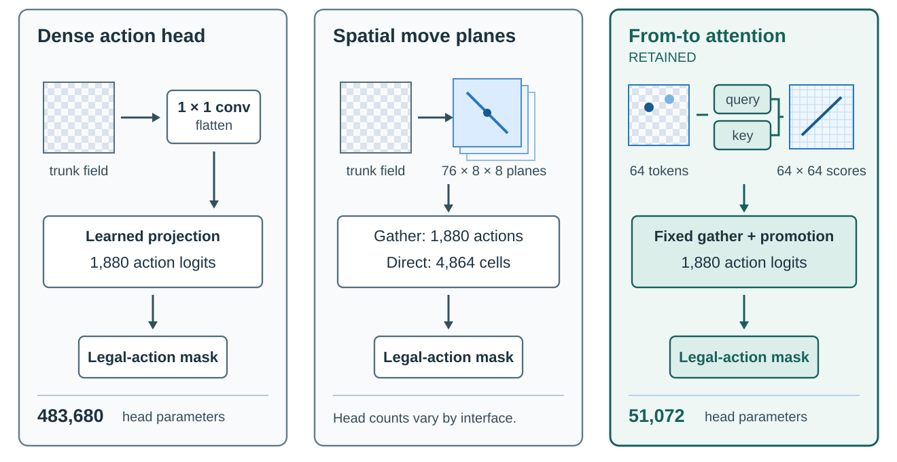

# 4C. Choosing what the network predicts

The network had to satisfy two objectives that are easy to conflate. It had to learn useful chess representations
from self-play, and it had to evaluate thousands of search leaves cheaply enough that those representations improved
within the available wall-clock budget. The resulting design was not selected by parameter count alone. Policy
representation, trunk structure, auxiliary supervision, quantization, and model growth were all tested against the
same end-to-end constraint.

The retained architecture receives a 52-plane, side-to-move-canonical chess representation; some earlier comparisons
used a 29-plane encoder, so their absolute results are not input-matched to the final model. The 52 planes include pieces, castling
rights, en passant, checks, repetition state, the eight most recent moves, material counts, and the fifty-move
counter. File reflection is the only training augmentation; it mirrors the action targets and exchanges kingside
and queenside castling planes. These rule-sensitive inputs are necessary to keep positions with different legal or
draw states distinguishable, but their individual strength contributions were not ablated.

## Three policy representations

The chess interface defines 1,880 canonical actions, but an action table does not determine how a network should
predict them. The project implemented three materially different policy families.

**Figure 4C.1 — Policy representation changes the learned output geometry.** Dense heads learn an action-sized
projection, move-plane heads preserve spatial move types, and the retained from-to head scores square pairs before a
fixed gather. The parameter counts are from the same controlled convolutional-trunk comparison; no count is shown for
the plane family because its implementations and external interfaces differed. The diagram is architectural, not a
playing-strength comparison.

The first used a conventional dense reduced-action head: a small spatial projection was flattened and mapped
directly to the 1,880 logits. Two-, four-, and eight-channel projections were explored, along with spatial reduction
and low-rank final maps. A rank-96 variant reduced a roughly 484,000-parameter head to about 207,000 parameters while
reportedly matching its immediate baseline. The underlying result bundle has not been recovered, however, so the
individual dense variants cannot support a reconstructed quantitative ranking. Dense heads nevertheless trained
successful models and should be described as superseded, not disproven.

The second family represented moves spatially. Its 76 planes comprised 56 sliding directions, eight knight moves,
and 12 promotions. One implementation gathered the canonical action logits from this tensor; another exposed all
4,864 plane-square cells as the action interface and normalized only the legal cells. The native mapping was checked
over 83,651 moves without a discrepancy, and controlled inference showed that the larger interface itself was not
the source of the observed slowdown. A repaired convolutional plane head reached 2.1828 held-out policy
cross-entropy after roughly 2,500 supervised steps, compared with 2.0824 for the dense control, while still improving
more quickly. That shortened comparison did not establish convergence. The owner also recalls a plane-policy model
learning more slowly and being retired after online self-play, but the corresponding result artifact—and even the
recalled plane count—has not been identified. The structured-plane family is therefore technically validated but
empirically underdetermined, not a quantified negative result.

The retained from-to head preserves square structure without predicting a mostly empty plane tensor. It projects the
64 trunk squares into query and key vectors, scores all origin-destination pairs, and gathers the canonical actions
through a fixed table. A separate projection adds queen, rook, and bishop offsets for promotions; en passant and the
canonical castling encoding remain ordinary square pairs. On the controlled convolutional trunk, this head used
51,072 parameters rather than 483,680 for the dense alternative.

Holding that trunk fixed, the from-to head improved the held-out policy gap by 0.0298 nats, with a paired 95%
interval of 0.0285--0.0311. Widening the trunk after recovering those parameters added only 0.0018 nats in the three
measured cells, although the missing fourth cell prevents a full factorial conclusion. The serving cost was modest
at production scale: approximately 1.9% of batch-512 forward throughput and 9% at batch 64. These measurements made
the from-to head the best-supported policy choice, but they came from a shortened, single-seed teacher-data study,
not an isolated long self-play match. Cross-entropy differences are reported as such and are not converted into an
invented Elo gain. The shortened teacher-data protocol limits the comparison's playing-strength interpretation.

The owner remembers roughly ten policy-head comparisons, including an online plane-head trial that trained more
slowly and underperformed. The full result bundle has not been recovered; the preserved plane implementation has 76
planes while the recollection names 96. That result remains qualitative and the two descriptions should not be
silently equated.

## Convolution, attention, and global context

The retained trunk is convolutional. Its residual tower shares one feature field among the policy, value, and
training-only heads. Full sharing was an invariant throughout the implemented research programme; no split
policy/value trunk was tested. The earlier impression that such a comparison existed arose from oversized policy
heads, including a second policy-shaped auxiliary, consuming much of a small model's capacity. Head capacity and
trunk separation are different questions.

Pure attention trunks were implemented with 64 square tokens, learned row and column embeddings, pre-normalized
self-attention, and GELU feed-forward blocks. Packed query/key/value projection replaced the generic attention
module. No-bias, learned relative-offset, and input-dependent Smolgen-style attention biases were implemented, though
only the no-bias and Smolgen choices received a preserved efficacy comparison. A CNN-attention hybrid was proposed
but not built.

Early comparisons were invalidated by different generation-zero policy shapes and by runtime and precision
confounds. After bootstrap calibration and a matched policy head repaired the comparison, the convolutional model
beat bare attention by 0.0060 nats on held-out teacher data. Smolgen produced the best attention cell, but much of the
apparent improvement attributed to attention actually came from replacing its dense policy head: on the attention
trunk, the from-to head improved the held-out gap by 0.1573 nats. Attention also used substantially more memory and
served more slowly in the relevant batches. The project therefore retained convolution for this workload; it did
not establish that attention is generally unsuitable for chess.

Local convolution is supplemented by a global-pooling residual module every second block. After the first
convolution, one quarter of the channels supply board-wide means and maxima that are projected back as biases on the
local features. Squeeze-excitation was also implemented and used historically. The owner recalls global pooling
learning faster without a clear difference at convergence, but no result artifact has been recovered. Its retention
is motivated by system experience and external KataGo evidence, not by a standalone chess Elo claim. It also leaves
floating-point islands in the quantized graph, illustrating that useful context and serving efficiency were not
always aligned.

## Value and training-only heads

The outcome head predicts win, draw, and loss rather than a single scalar. Search converts this distribution to an
expected value when necessary, while training and diagnostics retain the draw probability. A compact
two-channel spatial reduction and 48-unit hidden layer was retained. A matched 32-channel probe added 97,020
parameters and reduced measured training throughput by 1.31%, while improving total loss by only 0.00309 in one
short seed and slightly worsening WDL loss. This justified keeping the smaller head, not a claim that its capacity is
universally optimal. Likewise, the earlier scalar-to-WDL transition has no preserved isolated strength comparison.

The final training graph also predicts the later player's policy at a configured ply offset and normalized remaining
game length. Their loss weights are 0.15 and 0.1 respectively. The next-policy target lives in the future state's own
side-to-move action space and receives its own legality and symmetry transformations. Both heads are stripped from
the serving artifact. Wiring, eligibility, masking, gradients, symmetry, and checkpoint behavior were tested, but no
long matched online ablation isolates either objective. Legal-move prediction and several proposed search or board
state auxiliaries were not retained. During debugging, auxiliaries were also removed precautionarily without being
shown harmful; their final inclusion is an assembled-recipe choice rather than a causal Elo result.

## Bootstrap and optimization controls

Initialization is part of self-play because the untrained network creates the first search priors and therefore the
first replay targets. In an early architecture comparison, the attention policy placed only about 0.11 of its mass
on the top three moves while the convolutional control was effectively one-hot. Neither extreme was meaningful
chess knowledge, and their different concentrations changed the data each model generated. The retained bootstrap
path uses architecture-appropriate initialization, deterministic construction, a small final policy projection, and
calibration on 516 encoded positions from the evaluation dataset toward a common policy shape. These positions
calibrate numerical behavior; their human-game origin is not supervised pretraining or a source of chess targets.
Calibration controls concentration; it does not make an initial policy knowledgeable. A separate audit also found that the configured random seed had not originally
reached model construction, so supposedly matched arms began from different tensors. Corrected comparisons now treat
seed propagation and bootstrap shape as reproducibility requirements rather than hyperparameter wins.

The optimizer changed alongside the quantized architecture. AdamW trained earlier successful models and was
superseded rather than disproven. Frozen-replay screens showed that Nesterov SGD could train the quantization-aware
network stably and helped select warm-up, learning-rate, and folding behavior. Delayed folding improved the
historical pre-fold schedule, and higher post-fold rates improved short-horizon replay fitting within the tested
range. The production schedule was not a literal copy of the best short screen: the authoritative model remains
pre-fold until one million optimizer steps, and the deployment copy inherits the main linear learning rate. Frequent
gradient clipping in several screens did not prevent learning, but neither did it establish that the threshold was
optimal. These are controlled optimization diagnostics; online playing strength belongs to the complete trained
system. These short frozen-replay screens informed, but did not independently validate, the final online recipe.

## Quantization as an architectural constraint

Post-training quantization of the ordinary residual tower was fast and behaviorally unusable. Activation ranges
grew from about 0.78 near the input to roughly 40--43 late in the network; depending on calibration, full-trunk INT8
preserved only 13.3--25.9% policy top-one agreement. Weight-only quantization was faithful but slower than TensorRT
FP16. Quantization therefore became a network-design problem rather than a final export switch.

A scaled pre-activation block bounded the learning graph, but its normalization, clipping, residual scaling, and
requantization boundaries fragmented the compiled TensorRT graph. It expanded an 83-layer FP16 graph to 330 layers
and an INT8 graph to 470 layers, with many reformats, yet still failed fidelity. The retained scaled post-activation
block instead keeps the conventional sequence of convolution, normalization, capped activation, convolution,
normalization, scaled residual addition, and capped activation. Activations are capped at six, and residual branches
are scaled by the inverse square root of depth. The scale can be folded into the second convolution at export, which
preserves more efficient compiler tactics.

This block learned normally under quantization-aware training. After continuation in the folded deployment topology,
a production-sized smoke test reached roughly 135,000 INT8 positions per second, compared with 60,000 for
TorchScript BF16 and 99,000 for TensorRT FP16. These are model-core rates, not end-to-end self-play rates. Folding
only after training damaged agreement, and global context and the heads remain outside the INT8 trunk. The result is
evidence that architecture and deployment had to be co-designed; it is not evidence that the scaled block plays
better than an ordinary residual block in floating point. The fidelity and throughput measurements above distinguish
the tested alternatives.

## Progressive model sizing

KataGo provided the precedent [2]: start with a small, fast network, train the next size on the same data, and
switch when it catches up. Early in self-play, extra model capacity may contribute less than the additional searched
games a small network can produce. The measured small-model throughput supports that premise here, and the
small-to-medium handoff worked repeatedly. There is no equal-cost fixed-size control,
so its exact Elo-per-currency contribution remains unknown.

Candidate start follows a stage-specific searched-Elo plateau; promotion instead requires two passing paired
matches against the active model. The former loss-based gate promoted a candidate that was about 270 Elo weaker
because extra catch-up updates made its training loss incomparable. The failure study in Chapter 5 explains that
correction; Chapter 6 states the retained thresholds and promotion gate.

The larger stage remains unresolved. An independently initialized candidate needed substantial catch-up. Explicit
function-preserving growth avoided relearning the medium model's function, but may also bias optimization toward its
existing representation; that possible capacity cost was not measured. The limited grown-model continuation reached
parity without a clear strength gain, so the reported model remains medium-sized. A matched-compute comparison of
independent catch-up and growth would be needed to choose between them.

## Distillation and compact models

Two earlier compression programmes asked related but distinct questions. Teacher-output imitation trained compact
students on a legal-masked policy and WDL distribution from policy-only teacher play; no search generated those
labels. Increasing the dataset from one million to six million positions mattered more than a small capacity sweep.
The strongest 1.33-million-parameter student trailed its teacher by 176.1 Elo at 25 searches each and by 38.4 Elo
when it received the measured shallow equal-compute allowance of 58 searches. At 250 searches each the gap widened
to 257.6 Elo. Deeper search amplified the better prior rather than washing out approximation error. Fixed-ply
sampling gave the dataset only one side-to-move parity, and the teacher had a known conversion weakness, so these
absolute gaps do not transfer to the final model.

Replay-target compression instead trained on sparse MCTS visits, outcomes, root values, and replay metadata from a
frozen ten-million-row window. The selected 474,069-parameter student was 13.20 times smaller than its teacher. It
trailed by 291.3 Elo at 64 searches each and by 166.2 Elo when its measured saturated serving advantage allowed 186
searches against 64. It reached statistical parity only at an equal-multiply-accumulate allowance of 850 searches,
which ignored tree work, launches, and imperfect batching and was therefore not an equal-time result. The compact
artifact was useful, but it did not replace direct training. These were separate compression protocols, not direct
comparisons with the final teacher.

A terminal compression check trained a 470,295-parameter student on the final 20-million-row replay buffer. At
10,000 searches it reached 2,683 conditional benchmark Elo after roughly 7.5 epochs and 2,697 after roughly 23
epochs. The 14-Elo central difference lay well inside the match intervals, while held-out policy loss had become
nearly flat. Tripling passes over this fixed buffer therefore produced no measurable playing gain. The longer
student reached 2,873 conditional Elo at 100,000 searches, but the point is unbracketed and is not a calibrated
deep-search headline.

Together, the studies show that a small student can preserve substantial behavior and make a practical published
artifact, but not that model size can be exchanged mechanically for more search. Realized search multipliers were
far below parameter or arithmetic ratios, and the teacher advantage often grew with search depth. Distillation is a
compression result, not a stage of the primary self-play algorithm.

## Decision

The retained network combines the rule-complete 52-plane input, a shared convolutional trunk, periodic global
context, the from-to policy head, a compact WDL head, and training-only next-policy and remaining-length objectives.
Scaled post-activation blocks make the trunk compatible with quantization-aware deployment. Progressive sizing
successfully exploited a small model before handing off to the medium model, while the value of the larger stage
remains unresolved. This is one integrated design supported by component tests of different strength; the report
does not assign isolated Elo gains where only proxy, throughput, or assembled-system evidence exists.
