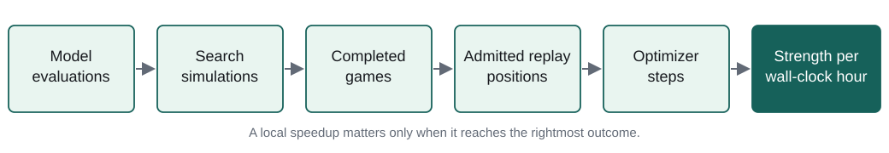

# 5. From inference speed to learning speed

Under a fixed compute budget, inference throughput matters through the training data it makes affordable.
Search, game completion, replay delivery, and optimization jointly determine that supply (Figure 9).
This chapter examines the bottlenecks at those stages and the scheduling required to share GPUs between actors
and the learner. Relative gains are reported within each controlled benchmark;
[Appendix C](appendix-c-supporting-comparisons.md) collects the absolute rates and settings.

Figure 9: Search speed passes through game completion, replay admission, and optimizer work before it can affect
playing strength. Each boundary has its own throughput measure.

## Native ownership of the search loop

Per-position Python dispatch made board updates, legal-move generation, encoding, and inference submission a
host-side bottleneck. The production loop therefore keeps game rules,
search trees, selection and backup, and asynchronous inference requests in C++. Python coordinates configuration,
replay, training, publication, and evaluation outside that hot path.

Each actor interleaves 512 games through a preallocated inference pipeline and retains search subtrees across
moves. The retained topology uses four actors per GPU, one inference worker per actor, batches of up to 320
positions, and two outstanding batches. This provides independent work to overlap tree traversal with
neural evaluation without introducing a Python boundary at each leaf.

## Batching and host-side submission

Batching amortizes GPU launch costs, but sustained utilization also requires timely host-side preparation.
Preallocated staging buffers, asynchronous copies, and completion events overlap encoding and submission with
GPU execution. CUDA graph replay reduces the remaining launch overhead.

In a controlled 32-process self-play workload, the optimized path increased search throughput by 20.5% while
reducing aggregate actor CPU consumption from 52.6 to 19.8 cores. Average
inference batch size rose from 141 to 222 and the number of model calls fell by 24%. On the same node restricted to
24 CPU cores, throughput more than doubled because reducing submission overhead allowed
the previously starved GPUs to remain busy. The larger gain under the CPU quota identifies host submission as a
substantial constraint on GPU utilization.

Full batches were necessary but insufficient for saturation. Reducing TensorRT actors from four to two per GPU
lowered search throughput by 39% despite full individual batches, because fewer actors reduced overlap between
CPU preparation and GPU inference. Additional inference threads instead duplicated CUDA contexts and fragmented
batches. The measurements supported process-level concurrency with one inference thread per actor.

Per-tree parallelism can supplement batching when too few independent games remain active. Unlike inter-game
concurrency, it changes leaf selection through virtual reservations and can reduce search quality. Its
strength-throughput tradeoff is examined in Chapter 4.

## Inference runtimes and precision

With host submission sustained, runtime and precision determine the cost of evaluating each batch. A TensorRT FP16 engine
delivered 1.86x the inference throughput of a TorchScript BF16 control in a matched benchmark.
Quantization-aware INT8 added a further 1.31x over TensorRT FP16 on the tested quantization-oriented network.
Production-topology tests found INT8 gains of 14.4% for the smaller network and 39.1% for the medium network.

As Section 4.3 explains, the INT8 speedup required training the network to tolerate quantization. Most trunk
convolutions run in INT8, while the start block, heads, and linear layers remain at higher precision. Export records
the quantization and dequantization operations explicitly in ONNX so TensorRT can compile the intended arithmetic.
Rather than rebuild the complete engine after every update, publication refits a prepared template with the new
weights [8]. Chapter 6 examines a failure in this step that made output comparisons essential.

The alternative `torch.compile` path accelerated eager batch-64 inference by roughly 27--33%, but
fused TorchScript remained faster. In the tested eight-GPU training workload, compilation reduced throughput by
about 18% relative to eager execution, while bfloat16 autocast improved it by 9.2%. Compilation was not retained
for production inference or training on this workload.

Similar parameter counts did not imply similar inference cost. Width and depth changed kernel efficiency,
TensorRT tactics, and memory behavior discontinuously. Channels-last layout and cuDNN autotuning helped relevant CNN
shapes, but no analytic parameter-count rule predicted the fastest network. Progressive model sizes were therefore
benchmarked at their actual serving batch and precision rather than selected from FLOPs alone.

## Replay materialization and training supply

Replay delivery must sustain both trajectory ingestion and training-batch retrieval. Parallel materializers
convert completed trajectories into a circular memory-mapped store, avoiding repeated trajectory decoding in the
training path. Direct column access and pinned-memory prefetching reduce batch preparation and transfer costs.

A loader benchmark on 2.5 million rows became 8.26x faster after compacting 5,000 small producer shards into
25 containers, putting delivery capacity 44% above the measured trainer demand. In a live interval,
materialization could append positions more than six times as fast as self-play supplied them. The replay pipeline
therefore had enough headroom to keep up with game production.

The configured reuse ratio couples optimizer progress to newly admitted positions, so loader capacity beyond
trainer demand does not by itself increase training volume. Persistent distributed trainer processes avoid startup and model
construction costs between blocks. The retained global batch of 2,048 uses bfloat16 autocast across eight GPUs.
Larger batches improved hardware throughput in the benchmark but also changed the number of optimizer updates
per training position, so batch size was selected as part of the learning recipe rather than for throughput alone.

## Overlapping self-play and training

Self-play and training compete for GPU capacity but have different resource profiles. Search includes CPU
traversal and transfer intervals that allow useful overlap with optimizer work. Scheduling must therefore balance
the slower training block against the reduction in subsequent waiting for new games.

The overlap sweep compared keeping 8, 16, or all 32 actors active during training. Including both training time
and the remaining wait for self-play, their estimated complete-quantum times were 117.1, 112.9, and 111.2 seconds.
Moving from half to all actors active nearly doubled the trainer's work time for only a small reduction in the
complete cycle. The retained half-active policy balances ongoing game production against optimizer throughput;
[Appendix C](appendix-c-supporting-comparisons.md), Table C1 gives both sides of this tradeoff.

The useful overlap fraction depends on search cost. As visit budgets and model size rise, self-play becomes more
expensive relative to training; actor settings measured at the beginning cannot simply be extrapolated to later
stages.

## Throughput allocation within the learning loop

The resulting system allocates throughput across data generation and optimization rather than maximizing either
in isolation. Native search and batched inference increase game supply, replay materialization prevents delivery
from limiting training, and actor overlap replenishes replay during optimizer updates.

Additional search capacity can support more games at a fixed budget or deeper searches per position. Those uses
alter data diversity and target quality differently, while replay reuse controls their rate of consumption.
The systems improvements therefore expand the feasible training regime; the recipe determines how that capacity
is spent. Chapter 8 evaluates the resulting progress in playing strength over wall-clock time.
