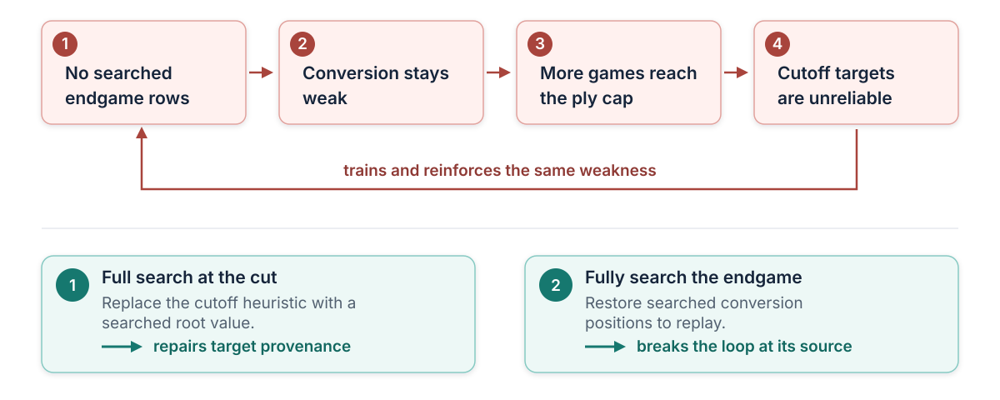

# 6. Three failures that changed the method

Most of the project can be explained by comparing alternatives without reconstructing when each experiment ran.
Three failures are different. In each case, the order of events is part of the mechanism: an apparently reasonable
optimization changed the data or model that the next stage consumed, the resulting failure exposed an invalid
assumption, and the repair changed the system's acceptance criteria.

## Late-game target poisoning

The self-play design once reduced search near the end of long games. The intent was to keep noisy positions from
exceptionally long endgames from dominating replay. If those positions would not become training targets, spending
full-search compute on them seemed wasteful, so the tail used cheap searches instead. Only full-search positions
were admitted as primary training rows, however, so the cheap-search tail selectively removed the conversion phase
from the training set. The resulting policy was weakest exactly where it needed to turn an advantage into a terminal
result. Games wandered to the ply cap more often, and the cutoff then assigned one terminal value to every earlier
training row in the trajectory.

This created a closed feedback loop. Missing searched endgames produced weak late-game play; weak play produced
drawn-out, unconverted games; the cutoff supplied an unreliable target; and that target reinforced the same policy
and value errors. During the most affected early interval, roughly one ply in seven was structurally ineligible for
training, 27--32% of games reached the cap, and about 36--38% of admitted rows inherited the value assigned to a cut
game. The corruption was therefore not confined to the last position: the final target propagated back through the
entire recorded trajectory. By the time the active replay buffer looked healthy, the damaging rows had already been
evicted, while their effect on the weights and subsequent self-play distribution could remain.

Figure 7: The cutoff repair fixes target provenance; restoring fully searched endgames breaks the feedback loop at
its source.

The repair happened in two stages. First, the cutoff stopped relying on the material heuristic and obtained a value
from one full search at the final cut position. A controlled continuation study supported that choice: on 2,282
early cut positions, the searched root value reduced Brier error from 0.491 to 0.444 and cross-entropy from 0.851 to
0.756 relative to the material target. The same ordering held on a later set of 1,144 positions. Later, the forced
cheap-search tail was removed altogether, returning properly searched endgame positions to replay. The second change
closed the data hole that a better terminal value alone could not repair. Because other late-game changes were
bundled around the same period, neither step receives an isolated Elo credit. The evidence establishes the failure
mechanism and target-quality improvement, not a one-variable strength estimate.

The broader lesson is that search eligibility, replay admission, and terminal-value provenance are one coupled
design. Saving compute by weakening or discarding a particular part of the trajectory can make the learner least
competent in that region, after which bootstrapping from its own weak continuation turns an efficiency optimization
into a self-reinforcing data defect.

## A mechanically valid but semantically invalid TensorRT refit

The deployment pipeline builds a structural TensorRT template and refits it with each new quantized checkpoint. One
template was built from a checkpoint whose clipped activation quantizers had many numerically equal scales. At high
optimization levels, TensorRT optimized the engine around those equalities. Training later separated the scales,
but the refit API still accepted every replacement weight, reported no missing weights, and returned success. The
resulting engine was structurally valid and semantically wrong.

The defect was visible only when the published engine was treated as a chess model rather than as a successfully
serialized object. On 516 real positions, the faulty template produced legal-policy KL near 1.05 and repeated refits
of the same inputs changed individual logits by 10--15. Building at a lower optimization level, or first making the
template's scale constants distinct, reduced legal-policy KL to about 0.0012 and made repeated refits deterministic.
The failure required three conditions: equal scales in the build source, optimization level four or higher, and a
later refit that made those scales unequal. Tests with identity batch normalization and zero biases rejected
constant folding as the cause. These probes isolated the refit-template defect.

Template construction now separates equal quantization scales before optimization and uses a safer default
optimization level. More importantly, deployment publication no longer treats deserialization, complete weight
accounting, or refit success as evidence of model equivalence. It evaluates the engine on real encoded positions and
records legal-move top-one agreement, legal-policy KL, and WDL error against the source artifact. Those checks cover
the semantics that search actually consumes: which legal move the policy prefers, how its probability mass changes,
and whether the value distribution remains faithful.

The transferable lesson is simple: a compiler or refitter can satisfy its mechanical contract while violating the
model's behavioral contract. Deployment artifacts must be validated as semantic models on representative inputs,
and the exact graph, template, runtime, refit manifest, and probe results belong to the evidence for every published
checkpoint.

## Promotion from incomparable training losses

The progressive controller originally promoted a larger candidate when its smoothed training loss caught up with
the active model. Loss looked like a cheap proxy for readiness: it was already measured during training, whereas a
full-search candidate match consumed additional evaluation compute and time. That comparison ceased to be meaningful
once the candidate received extra optimizer quanta over the same replay distribution. More presentations gave it a
systematic advantage on replay loss without proving equal playing strength. The loss gate promoted a candidate whose
deployed artifact passed inference-fidelity checks but was still about 270 Elo weaker in play.

Promotion now measures the property that publication requires. The candidate plays paired head-to-head matches
against the active deployment artifact and must score at least 0.48 in two consecutive completed evaluations. A
failing score resets the sequence; a failed or cancelled match contributes no evidence. Candidate-start timing,
extra catch-up training, and promotion are separate controls. Function-preserving growth is likewise a separate
attempt to remove the larger model's initial relearning deficit, not a substitute for the playing-strength gate.
Chapter 7 states the retained candidate-start and promotion procedure.

Training loss remains valuable for optimization diagnostics. It is not a promotion criterion when the compared
models have seen different numbers of presentations or when the artifact intended for deployment can be tested
directly.
