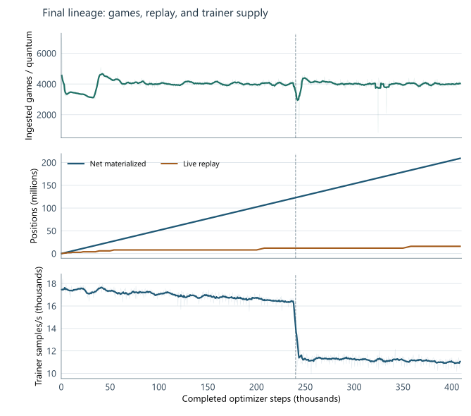

# 7. Training progress under limited compute

The final training run produced a 6.32-million-parameter chess model in 2.5 days on one node with eight
RTX 4070 SUPER GPUs and 80 logical CPUs. This chapter examines the progression in strength and the training volume
made possible by the integrated system. The complete recipe is specified in [Appendix D](appendix-d-reproducibility.md);
`chess-final-config.yaml` [10] remains the entry point for reproduction.

## Progress across training campaigns

Figure 11 compares the 64-search training ladders across five chess campaigns. The final recipe reached a higher
plateau within a shorter training window than the preceding baseline. Its training-ladder rating rose from about
800 to 2,370, with a peak near 2,410.

Figure 11: Smoothed 64-search training ladders across five chess campaigns. The final curve ends at 2.5 days and
the preceding baseline at 3 days. Appendix B specifies the windows and the common-estimator plateau comparison.

On a common rating estimator, the final recipe improved the preceding baseline's plateau by about 74 Elo.
This summarizes the change in the complete recipe rather than attributing the gain to any single component.
The larger progression across the plotted campaigns reflects successive changes to architecture, data generation,
and training efficiency.

## Training volume and model transition

Table 3 summarizes the scale of the final run. Using a conservative mean of 100 searched plies per game and
roughly 600 simulations per move gives an estimated 195 billion search simulations.

| Quantity | Final training |
| --- | ---: |
| Duration | 2.5 days |
| Model parameters | 6.32 million |
| Completed games | 3.25 million |
| Materialized positions | 209 million |
| Training presentations | 837 million |
| Optimizer steps | 409 thousand |
| Live replay at selection | 16.0 million positions |
| Node rental cost | $43.2 |

Figure 12 relates this volume to replay growth and the transition from the 12×128 to the 14×160 model.
The smaller network supported faster early training; median trainer throughput fell from about 17.0 thousand to
11.2 thousand samples/s across the two stages. Search increased from 300 to 600 visits per move over the plotted
run. The configured 800-visit stage lies beyond the selected checkpoint.

Figure 12: Training volume and throughput on a common optimizer-step axis. Panels show completed games per
training block, cumulative materialized positions, live replay occupancy, and trainer throughput. Replay capacity
increases in steps, while the small-to-medium transition coincides with lower trainer throughput.

The expanding replay window retained a broader history of self-play while the learner received approximately four
presentations per admitted position. Throughput, search budget, and replay growth therefore changed together as
training progressed. Loss, learning-rate, and gradient diagnostics are provided in Appendix A.

The reported checkpoint was selected near the strongest region of the training ladder. A function-preserving
19×176 continuation recovered parity but did not establish a higher plateau. Chapter 8 evaluates the selected
model at larger search budgets and compares it with the distilled student.
