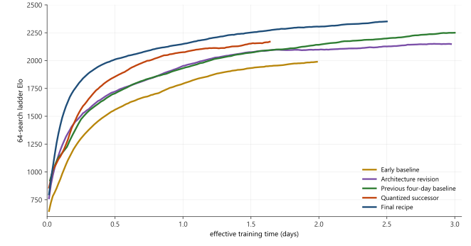
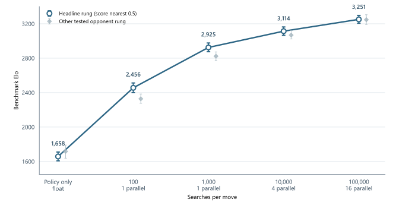

# 8. Final training and evaluation results

The selected 14×160 chess model has 6.32 million parameters and reaches
**3,251 benchmark Elo at 100,000 searches per move** in the paired Stockfish 13 evaluation introduced in
Chapter 2. This chapter follows its
2.5-day training trajectory, compares it with the previous chess recipe, and shows what additional search and a
much smaller distilled model achieve.

## Training progress

The 64-search training ladder rose from 798 to 2,372.2 over 2.5 effective days, with a peak of 2,407.6 in that
window. Figure 8 places this trajectory beside four earlier chess campaigns. The final curve retains 180
observations and ends before subsequent experiments that did not improve the selected model; the preceding
baseline stops at three days, before its noisy terminal interval.

Figure 8: Bias-corrected 0.95 exponential moving averages show the project's successive 64-search training
ladders. The final curve ends at 2.5 days and the preceding baseline at 3.0 days. The curves show training
progress; the matched comparison below uses a common estimator rather than subtracting plotted endpoints.

The plotted curves make the progression visible, but the previous baseline and final run originally used
different ladder estimators. Recomputing their plateaus on the same three-rung estimator gives 2,283.9 and
2,358.0 benchmark Elo: **about +74 Elo** for the final recipe. This compares complete training recipes, not an
isolated contribution from any one change. Appendix B gives the transfer calculation and its uncertainty.

Checkpoint 1026 was selected from several checkpoints near the strongest 64-search ladder region. It was the
last one there with complete model, optimizer, QAT, ONNX, and TensorRT artifacts retained. The plotted lineage
excludes reverted INT8 and capacity-promotion branches. A later function-preserving 19×176 continuation recovered
its parent's strength but did not establish a higher plateau.

The selected checkpoint followed **408,500 optimizer steps** in 817 training quanta. At a global batch of 2,048,
that is **836,608,000 training presentations**. Self-play completed **3,249,647 games**, materializing
approximately **209.15 million net positions** over the same lineage; replay held **16 million live rows** at
selection. Thus the learner saw about four training presentations per admitted position. Appendix A shows the
trajectories and counting boundaries.

At a conservative 100 searched plies and roughly 600 simulations per game move, 3.25 million completed games
correspond to approximately 195 billion search simulations. Most require a neural-network evaluation.

Across 480 small-model quanta, median measured trainer throughput was 16,977 samples/s; across 337 medium-model
quanta it was 11,194. These stages also differed in schedule and concurrent workload. The selected training path
occupied the node for 60 hours at $0.72/h, or **$43.20** in rental cost. Discarded experiments, later growth,
distillation, evaluation, and idle rental time are outside that figure.

## Playing strength across search budgets

Search transforms the same trained network from **1,658 benchmark Elo without search** to
**3,251 at 100,000 searches per move**, a difference of 1,593 points on this benchmark. Table 1 in Chapter 2 gives all ten
paired-match rows; Figure 9 shows the selected rating at each budget, with the alternate tested opponent rung
visible beside it. Gains continue through the deepest measured point, though each later increase in search buys a
smaller increment of Elo.

Figure 9: Connected points use the opponent rung with score nearest 50%; pale diamonds mark the other tested rung,
and bars show 95% match-bootstrap intervals. The categorical horizontal axis separates policy-only play from
100, 1,000, 10,000, and 100,000 searches per move; its spacing does not represent compute.

At the deepest budget, the 100,000-node and 200,000-node Stockfish opponents imply 3,247 and 3,251 benchmark
Elo, respectively. Their four-point agreement supports the headline result. A 100,000-search move takes roughly
five seconds of thinking time on an RTX 4070 SUPER with the current setup.

### Parallel search trades time for strength

The measured strength curve uses one parallel search at 100 and 1,000 searches per move, four at 10,000, and
sixteen at 100,000. A controlled 1,000-search sweep against the same 20,000-node opponent shows why: one parallel
search measured 2,823 Elo, four measured 2,804, and sixteen measured 2,778. Their central differences of 19 and
45 Elo are smaller than the overlapping match intervals, while the recorded match time fell from
**18.1–18.5 minutes** to **3.4–3.8** and **1.3–1.8**, respectively. These are two observed timing ranges,
not confidence intervals. The paired speedup ratios span approximately **4.8–5.3×** for four-way and **10.1–13.9×**
for sixteen-way parallelism.

At only 100 searches, sixteen-way parallelism reduced the central strength estimate by 235 Elo. The available
points suggest that a fixed parallel count becomes less costly as the total budget grows, but they are too sparse
to specify a safe budget-by-parallelism frontier. Appendix C gives the controlled operating points.

## Distilling a smaller player

A 470,295-parameter student—13.4 times smaller than the teacher—reached **2,697 [2,640, 2,753] benchmark Elo**
at 10,000 searches after 110,000 training steps. The shorter 36,621-step student reached **2,683 [2,637, 2,731]**
under the same opponent and search setting. The 14-Elo central difference lies within match uncertainty, and
held-out policy loss had nearly flattened. At 100,000 searches, the longer student reached
**2,873 [2,819, 2,935]**, although only one opponent rung was run there.

Both students trained on the same separate, frozen 20-million-row replay snapshot; they did not use the teacher
checkpoint's 16-million-row live training window. Student evaluations used TorchScript, whereas the searched
teacher used INT8 TensorRT, so these results describe a compact playable system rather than an architecture-only
teacher/student comparison. Appendix B gives the W/D/L counts and the skipped-rung boundary.
