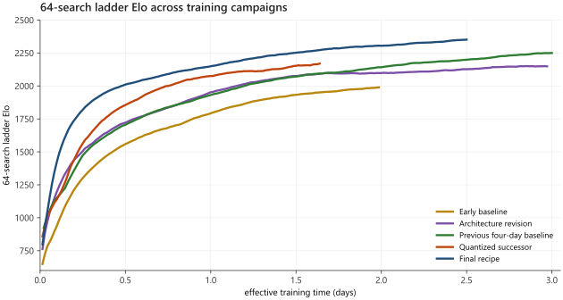

# 7. Final training and evaluation results

> **Evidence state.** Teacher training, the ten-row terminal matrix, the parallel-search sweep, and both distilled
> student experiments are complete and checksum-covered. The quantitative authority is the
> [final-run result record](../results/final-chess-run.md), backed by the
> [compact evidence index](../evidence/final-chess-20260923/README.md).

## What was selected

The strongest fully retained checkpoint is a **6.32-million-parameter, 14-block, 160-channel convolutional model**
with scaled post-activation residual blocks, global context conditioning, and a chess from-to attention policy head.
It was trained with quantization-aware training. Searched results use its INT8 TensorRT artifact; policy-only results
use the corresponding float TorchScript export because no native search service is involved. The inference path is
therefore stated with each result rather than silently treating unlike backends as identical.

The ladder's strongest region spans several nearby checkpoints rather than a single isolated spike. Generation 1026
was the last checkpoint in that region for which the full model, optimizer, QAT, ONNX, and TensorRT set had been
retained. A subsequently grown 19-block, 176-channel model recovered its parent's strength but remained flat and did
not justify replacing the selected checkpoint.

## Training outcome

The report-scoped final lineage contains **180 observations through exactly 2.5 effective days**. It rose from 798
to **2,372.2** at the cutoff and reached a peak of **2,407.6** inside that interval. Later points belong to capacity
and training experiments that did not improve the accepted result and are excluded from the comparison rather than
presented as continued final-model training.

The previous four-day baseline is cut at exactly **3.0 days**, retaining 143 clean observations and ending at
2,265.4 Elo. Later points from its noisy terminal evaluation interval are excluded. The two plotted endpoints differ
by 106.8 Elo, and the final endpoint is 348.2 Elo above the early baseline's terminal observation. These are
descriptions of the trimmed curves, not valid cross-campaign strength estimates, because the previous baseline used a
single-rung fit while the final campaign's generic ladder series used a three-rung bracketed fit.

A retrospective plateau comparison on the same three-rung estimator places the previous baseline at 2,283.9 Elo
and the final recipe at 2,358.0 Elo: **+74.1 Elo**, with an approximately **±15 Elo transfer/sensitivity allowance**.
The allowance reflects uncertainty in transferring the estimator correction; it is not a game-level bootstrap
confidence interval. The report therefore uses **about +74 Elo under a matched estimator** as the cross-campaign
headline and does not compare raw peaks.

Figure 7.1: Each curve uses the bias-corrected 0.95 exponential moving average used by the project's earlier
training-dynamics plots. The final recipe is cut at 2.5 days and the previous four-day baseline at 3.0 days. The tracked
[publication input](../evidence/final-chess-20260923/ladder-elo-report-trimmed.json) records those rules and retains
the source-series identities; internal run labels do not appear in the figure. The figure is descriptive; the +74.1
Elo claim comes from the matched-estimator plateau audit rather than from subtracting its displayed endpoints.

That stitched curve is not the entire compute history. It deliberately excludes two reverted branches while retaining
their raw time in the source export:

1. An early INT8 conversion collapse was detected after one ladder observation and reverted.
2. A from-scratch capacity increase was promoted because training losses were compared across candidates that had
   seen different numbers of examples. The larger candidate was still roughly 270 Elo weaker. Training returned to
   the last valid checkpoint and removed 4,040,112 contaminated replay rows.

The second incident changed the method, not merely the operational state. Promotion now uses a match between deployed
artifacts rather than training-loss parity, and capacity growth starts from a function-preserving widening of the
parent. The corrected larger model reached parity but did not break through the plateau. This is evidence against
capacity being the immediate bottleneck under the tested recipe; it is not evidence that larger networks cannot help
under a different learning-rate, target-quality, or replay regime.

The selected checkpoint records 408,500 completed optimizer steps. With the configured global batch of 2,048 this
corresponds to **836,608,000 training presentations**. Final games, admitted positions, replay occupancy, and
resume-reconciled reuse remain to be derived from the archives.

The narrow cost attached to the selected checkpoint is **$43.20**, calculated as 60 accepted-lineage hours at
`$0.72/h`. It excludes the reverted work, later growth experiment, distillation, evaluation, and idle rental time.
Until total spend is reconciled, it must not be described as the project's total compute cost.

## Strength across four decades of search

The terminal protocol used 100 games per row from 50 colour-swapped opening pairs against single-threaded Stockfish
13 at fixed node limits. For each search budget, the reported rating is the opponent rung whose score lies closest to
0.500.

| Search budget | Headline score and anchor | Benchmark Elo (95% CI) | Increment |
| ---: | --- | ---: | ---: |
| Policy only | 0.440 vs 1,000 nodes | **1,658 [1,608, 1,710]** | -- |
| 100 | 0.480 vs 10,000 nodes | **2,456 [2,400, 2,512]** | +798 |
| 1,000 | 0.450 vs 50,000 nodes | **2,925 [2,875, 2,977]** | +469 |
| 10,000 | 0.520 vs 100,000 nodes | **3,114 [3,065, 3,163]** | +189 |
| 100,000 | 0.530 vs 200,000 nodes | **3,251 [3,206, 3,297]** | +137 |

Search therefore adds 1,593 benchmark Elo from policy-only play to the deepest measured condition, with diminishing
returns at each decade. The 100,000-search estimate is unusually well anchored: an independent 100,000-node opponent
gives 3,247 Elo, only four points below the 200,000-node result. That local agreement supports the top headline, but
does not validate extrapolation beyond the measured anchors.

The complete ten-row matrix, including W/D/L and archive-capture status, is in the
[result record](../results/final-chess-run.md#terminal-evaluation-protocol).

## Two protocol effects that matter

### Weak opponents bias low-budget estimates

At 100, 1,000, 10,000, and 100,000 searches, the harder opponent rung reads 128, 102, 46, and 4 Elo higher than the
easier rung. The shrinking gap is consistent with draw distortion against weak opposition. It is a serious concern at
low budgets but immaterial to the deepest result.

### Parallelism buys time by spending strength

The headline curve is an operating curve, not a pure search-budget ablation: it uses one parallel search at 100 and
1,000 searches, four at 10,000, and sixteen at 100,000. A controlled 1,000-search sweep measured 2,823 Elo with one
parallel search, 2,804 with four, and 2,778 with sixteen. Four-way parallelism therefore cost 19 Elo; sixteen-way cost
45 Elo.

The operational timing definition reports approximately 5.3x speedup for four-way and 13.9x for sixteen-way
parallelism. The result manifests' broader aggregate-duration fields imply smaller 4.8x and 10.1x ratios. Both are
preserved pending a final timing-definition choice. At only 100 searches, sixteen-way parallelism cost 235 Elo, so
parallelism cannot be changed silently across a compute curve.

## What the student establishes—and what it does not

Both completed students have **470,295 parameters**, 13.4 times fewer parameters than the teacher. They differ only
in training duration on the same 20-million-row replay snapshot. At 10,000 searches against the same 20,000-node
anchor, the 36,621-step student scored 31/33/36 for **2,683 Elo [2,637, 2,731]**; the 110,000-step student scored
35/29/36 for **2,697 [2,640, 2,753]**. Tripling training from exactly 7.500 to 22.528 replay epochs therefore moved
the point estimate by 14 Elo, well inside the confidence intervals.

The longer student's training/held-out policy losses ended at 1.8613/1.8815, a roughly 0.020 gap that was flat from
about step 60,000. Combined with the match, this suggests that the small architecture had saturated on this dataset;
it does not demonstrate a memorisation collapse.

At 100,000 searches the longer student scored 59/28/13 against the 20,000-node anchor, corresponding to **2,873 Elo
[2,819, 2,935]**. The planned 50,000-node bracket was skipped, so this remains an unbracketed lower anchor-based
estimate. The student used TorchScript and the teacher INT8 TensorRT, further preventing a clean architecture-only
comparison. Elo is an interval scale: parameter compression can be expressed as 13.4x, but ratings cannot be
meaningfully expressed as one model having a percentage of another model's Elo.

## Figures still required

The numerical result is ready; the visual account is not. Publication still requires:

1. Detailed final-lineage ladder Elo against both stitched and raw time, with discarded intervals visible.
2. Total, policy, WDL, and auxiliary losses alongside learning rate and optimizer step.
3. Games, fresh positions, training presentations, replay occupancy/age, and trainer/self-play throughput.
4. Quantization fidelity, backend changes, capacity-growth attempts, and other material interventions.
5. A cost view that separates accepted training, discarded work, distillation, evaluation, and idle rental time.

The root README can now use the checksum-complete result tables and generated headline ladder figure. Remaining
figures and accounting should still distinguish what is complete from what awaits archive-derived reconciliation.
