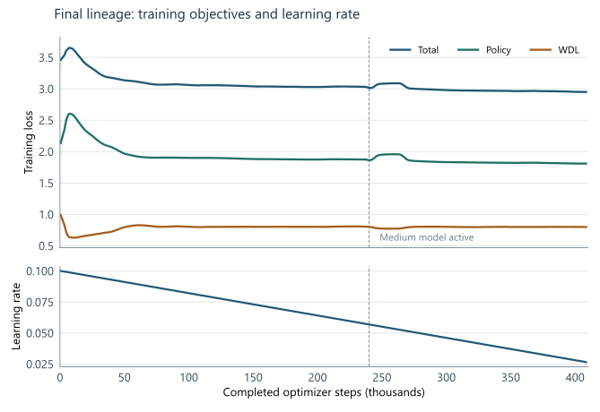

# Appendix A. Training diagnostics

The figures in this appendix describe the accepted training lineage through the selected checkpoint. They do not
include the reverted INT8 conversion, the invalid capacity-promotion branch, or the later limited continuation of
the larger model. A quantum comprises 500 optimizer steps at a configured global batch of 2,048. The selected
checkpoint follows 817 contiguous quanta and records 408,500 optimizer steps and 836,608,000 presentations.
The published checkpoint number, 1026, is an artifact identifier, not the number of quanta included in this
selected-lineage plot.

Figure A.1: Total, policy, and WDL training losses are shown as raw traces and 11-quantum moving averages, with
final values labeled directly. The dashed line marks the small-to-medium active-model transition at 240,000
optimizer steps. Loss levels across model stages are optimization diagnostics, not paired playing-strength
measurements. From 300,000 steps to selection, total loss falls only from about 2.98 to 2.95, while WDL loss stays
near 0.80. The active learning rate fell from about 0.10 to 0.0266 by selection.

Figure A.2: Four panels separate per-quantum completed games, cumulative net materialized positions, live replay
occupancy, and training samples per second on the same optimizer-step axis. The separate replay scale exposes its
capacity steps: 209.15 million net positions were materialized, while 16 million rows were live at selection. The
small model's median measured trainer throughput was 16,977 samples/s across 480 quanta; the medium model's was
11,194 across 337. Model shape, schedule, and concurrent workload differ, so the gap is not an isolated model-size
effect. All panels describe the selected lineage, whose coordinator counters sum to 3,249,647 completed games.
