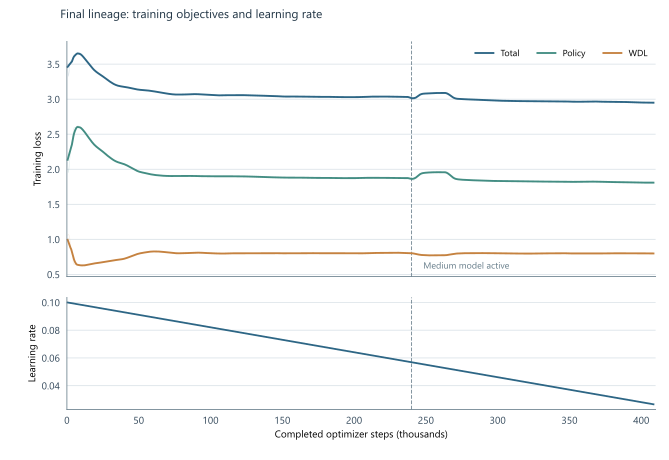
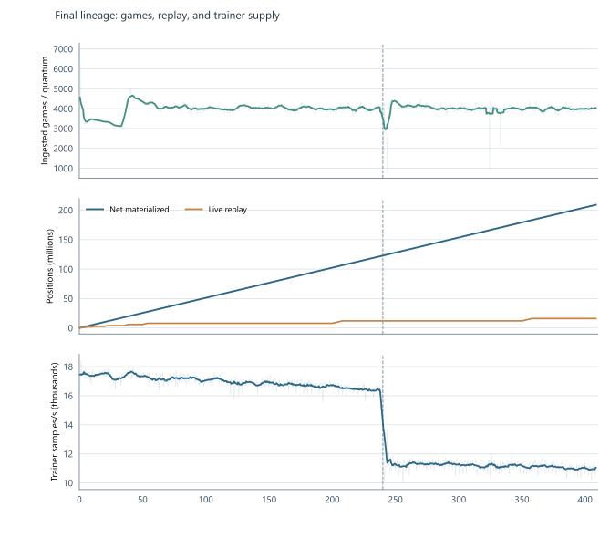

# Appendix A. Training diagnostics

The figures in this appendix describe the accepted training lineage through the selected checkpoint. They do not
include the reverted INT8 conversion, the invalid capacity-promotion branch, or the later limited continuation of
the larger model. A quantum comprises 500 optimizer steps at a configured global batch of 2,048. The selected
checkpoint follows 817 contiguous quanta and records 408,500 optimizer steps and 836,608,000 presentations.

Figure A.1: Total, policy, and WDL training losses are shown with an 11-quantum moving average over faint raw
observations. The dashed line marks the small-to-medium active-model transition at 240,000 optimizer steps. Loss
levels across model stages are optimization diagnostics, not paired playing-strength measurements. The active
learning rate fell from about 0.10 to 0.0266 by selection.

Figure A.2: Per-quantum completed games, net materialized positions, live replay occupancy, and training samples
per second share an optimizer-step axis. The small model's median measured trainer throughput was 16,977 samples/s
across 480 quanta; the medium model's was 11,194 across 337. Model shape, schedule, and concurrent workload differ,
so the gap is not an isolated model-size effect.

The coordinator's per-quantum ingested-game counters sum to 3,249,647 completed games. The credit ledger ends at
approximately 209.15 million net materialized positions, or 4.00 presentations per net position. Replay held
16 million live rows at the selected checkpoint; cumulative positions and live occupancy are different quantities.
The cumulative TensorBoard position scalar uses float32, so its final few integer digits are not meaningful. These
counts apply to the selected lineage, not to all experiments or all generated games.
