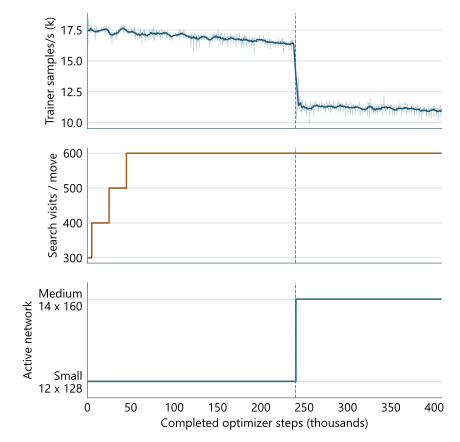

# Appendix A. Training diagnostics

The diagnostic traces cover the training sequence that produced checkpoint 1026: 817 quanta of 500 optimizer
steps at global batch 2,048, totaling 408,500 steps and 836,608,000 presentations. Checkpoint identifiers include
additional experimental branches, whereas these plots exclude the reverted INT8 conversion, invalid capacity
promotion, and subsequent larger-model continuation. Checkpoint 1026 was selected near the strongest 64-search
ladder region and was the last checkpoint in that region with the complete model, optimizer, QAT, ONNX, and
TensorRT artifacts retained.

Figure A.1: Training losses and learning rate. Raw losses are overlaid with 11-quantum moving averages; the
dashed line marks the small-to-medium transition at 240,000 optimizer steps. From 300,000 steps to selection,
total loss decreases from approximately 2.98 to 2.95 while WDL loss remains near 0.80. The learning rate declines
from approximately 0.10 to 0.0266. Labels identify the final values.

Figure A.2: Training volume and throughput on a common optimizer-step axis: completed games per quantum,
cumulative net materialized positions, live replay occupancy, and training samples per second. The run completed
3,249,647 games and materialized 209.15 million net positions, with 16 million rows retained at selection.
Median trainer throughput was 16,977 samples/s across 480 small-model quanta and 11,194 across 337 medium-model
quanta under their respective schedules and concurrent workloads.

Figure A.3: Next-policy and remaining-game-length losses on separate scales. Faint traces show recorded values;
solid curves show 11-quantum moving averages. The dashed line marks the small-to-medium transition, as in the
remaining optimizer-step plots.

Figure A.4: Mean pre-clipping gradient norm in each 500-step training block. The dotted line is the configured
norm limit of 1.0. The mean rises above that limit during medium-model training; the optimizer clips individual
steps before applying them.

Figure A.5: Policy-only and 64-search training-ladder ratings over the final 2.5-day window. Faint traces show
individual evaluations and solid curves average eleven evaluations. Both improve over training; Table 1 reports
the separate final matches.

Figure A.6: Trainer throughput, self-play search budget, and active network. The small-to-medium transition
coincides with lower trainer throughput. The plotted training sequence increases search from 300 to 600 visits;
the configured 800-visit stage lies beyond the selected checkpoint.

Replay occupancy, sampled-position age, and resignation calibration are shown with their corresponding methods
in Section 4.2 (Figures 5 and 6).
